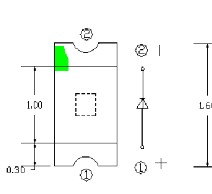

# LED0603 — indicator LEDs

| | |
|---|---|
| Component | `LED_RED_0603` `LED_YELLOW_GREEN_0603` |
| Manufacturer | Hubei KENTO Elec |
| Part number | `KT-0603R, KT-0603YG` |
| LCSC | [C2286](https://www.lcsc.com/product-detail/C2286.html) |
| Footprint | `LED_0603_1608Metric` |

| Role | Part number | LCSC | Forward voltage | Library | Stock |
|---|---|---|---|---|---|
| Fault | KT-0603R | C2286 | 1.8–2.4 V | Basic | 3,369,601 |
| Status, comms | KT-0603YG | C2289 | 2.0–2.2 V | Extended | 51,267 |

20 mA maximum. Read from JLCPCB's component API on 2026-09-17.

**Why not a green.** The obvious basic green, KT-0603G (C12624), is a 3.1 V
part. Driven from a 3.3 V pin through 1 kΩ it would pass 0.2 mA at best and
nothing at the rail's low corner. A check requires every indicator to be visibly
lit at the worst corner and inside both its own rating and the pin's 20 mA.

## Polarity, and a disagreement worth knowing about

KENTO's specification for approval, Rev. A.0. The green corner mark sits at
terminal **2**, and the symbol beside it puts the cathode bar at terminal 2
with a `+` against terminal 1. **On KENTO's own numbering, terminal 1 is the
anode.**

KiCad numbers it the other way: `Device:LED` puts the cathode on pin 1, and
`LED_0603_1608Metric` reaches its silkscreen out past pad 1. The board follows
KiCad - pad 1 is on GND, pad 2 goes through the resistor to the driving pin.

**Both are right, and the board is right, because a two-terminal chip part is
not placed by pad number.** The machine orients it by the polarity mark on the
part against the polarity mark on the board, and those agree: KENTO's green
corner is the cathode, and the board's silkscreen bar is at the cathode end.
What would break it is a footprint whose bar sits at the other end, which fits,
passes DRC and lights nothing — so
`test_every_polarised_part_marks_its_cathode_on_the_silkscreen` now holds every
diode and LED on the board to it, and it is break-tested by flipping one.

**Footprint.** KiCad stock `LED_SMD:LED_0603_1608Metric`, unmodified.
