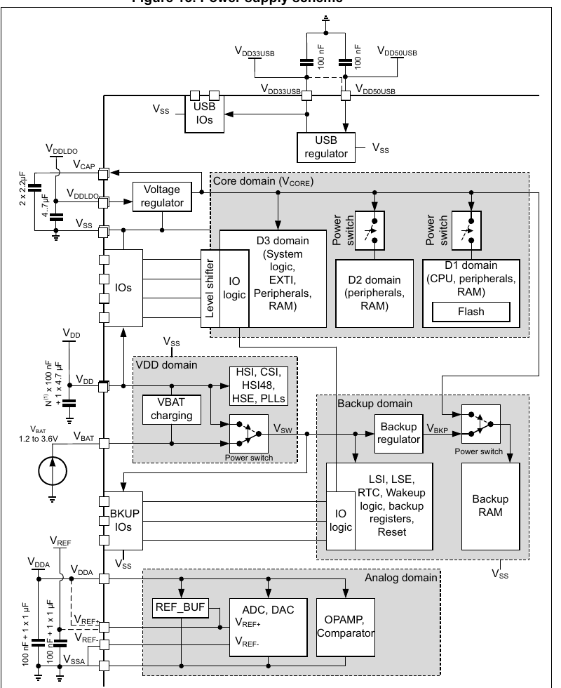

# LQFP144 — the MCU

| | |
|---|---|
| Component | `MCU_H743` |
| Manufacturer | STMicroelectronics |
| Part number | `STM32H743ZIT6` |
| LCSC | [C114408](https://www.lcsc.com/product-detail/C114408.html) |
| Footprint | `LQFP-144_20x20mm_P0.5mm` |

Cortex-M7 at 480 MHz, 2 MB flash, 1 MB RAM, 114 I/O, LQFP-144 20 × 20 mm,
−40 to +85 °C, supply 1.62 to 3.6 V.

| Qty | $ each |
|---|---|
| 1–9 | 11.06 |
| 10–29 | 9.92 |
| 30–99 | 9.18 |
| 100+ | 8.48 |

Read from JLCPCB's component API on 2026-09-17 and cross-checked against
LCSC's product page for C114408, which states `STM32H743ZIT6`, `LQFP-144`,
`2MB`, `1MB` and `480MHz`.

## Stock: zero

**JLCPCB listed no stock of this part on 2026-09-17.** Every other part on the
project's boards so far had thousands. An assembled order needs either stock to
return, a consigned reel, or hand-fitting the MCU. This has to be resolved
before ordering, not discovered at checkout.

## Figures used from the datasheet

ST's datasheet, *STM32H743xI*, DocID030538 Rev 3 (October 2017), served by LCSC
for C114408. ST's own site did not respond to automated requests, so AN4938 —
ST's hardware development guide for the part — was not read.

| Figure | Value | Where |
|---|---|---|
| Supply voltage | 1.62 to 3.6 V | Table 23 |
| VCAP capacitor CEXT | 2.2 µF per VCAP pin, ESR < 100 mΩ | Table 24 |
| HSE maximum critical gm | 1.5 mA/V | Table 43 |
| HSE load capacitors | 5 to 25 pF typical | Section 6.3.8 |
| LSE maximum critical gm | 0.5 / 0.75 / 1.7 / 2.7 µA/V by drive | Table 44 |
| I/O pin current | 20 mA absolute maximum | Table 21 |
| Supply current | **includes VDDA** | Figure 14, crop in `evidence/` |
| Input voltage, TT_xx pins | **4.0 V absolute maximum** | Table 20, crop in `evidence/` |
| Injected current, TT_xx pins | **−5 / +0 mA** | Table 21, crop in `evidence/` |

**The analog inputs' ceiling is a voltage with nothing below it.** The TT_xx
row of Table 20 states a flat 4.0 V of its own, where the FT_xxx row above it
is written as a formula on the supplies — so the number everybody reaches for,
V_DD plus a diode drop, is the wrong one here. And Table 21 rates injected
current on those pins at minus five to **plus nought** milliamps, with note 3
reading verbatim: *"Positive injection is not possible on these I/Os and does
not occur for input voltages lower than the specified maximum value."* There
is no positive-injection path to be inside of.

Both crops are committed because this pair of figures is what decided the
analog rail: the power board's sensors run from a 3.3 V regulator rather than
5 V through a bead, so the worst a sensor can rail to is 3.366 V. See
`parts/SOT23_5/SOT23_5.md`.
| NRST capacitor | 100 nF, internal pull-up 30–50 kΩ | Figure 21, Table 62 |
| Supply decoupling | N × 100 nF + 1 × 4.7 µF on VDD; "100 nF + 1 x 1 µF" pairs | Figure 13 |

**Figure 13, read.**

Rendered from ST's own document and read, which settles what the extracted
text could not — which value belongs to which pin:

| pin | what Figure 13 puts on it | on this board |
|---|---|---|
| V_DD, each | 100 nF | one each, matched pin to pin by a check |
| V_DD, the group | 1 × 4.7 µF (N = the package's VDD count) | yes, on 3V3 |
| V_CAP ×2 | 2.2 µF each | yes, and Table 24 sets the ESR |
| V_DDLDO | 4.7 µF | shares the rail's, VDDLDO being on 3V3 here |
| V_DDA | 100 nF + 1 µF | yes |
| V_REF+ | 100 nF + 1 µF | yes |
| V_DD33USB, V_DD50USB | 100 nF each | yes |

The board also carries a 1 µF on 3V3, which the figure does not ask for. It
stays, and `test_supplies_have_their_bulk_capacitance` now says so rather than
implying ST require it.

ST's AN4938 has still not been read, and cannot be from this environment:
`www.st.com` resolves but refuses every connection, which is why the datasheet
here is LCSC's copy of it. Nothing above depends on the application note —
Figure 13 and Table 24 are the datasheet's own.

## Why this part

Recorded in [`docs/research/README.md`](../../../../docs/research/README.md#decision).

## Pin mapping

Not taken from a datasheet page, and not in need of a human eye, because it is
checked by machine. The symbol is KiCad's `MCU_ST_STM32H7:STM32H743ZITx`, and
`hw/cpu1/checks/test_pinmap.py` requires every one of its 144 pin positions and
every I/O pin's function list to match ST's own data for the part, vendored in
`hw/silicon/STM32H743ZITx/`. The footprint's pads are numbered 1–144 and
`hw/checks/test_symbols.py` requires them to match the symbol's pins.

What that does not establish is that pad 1 of the stock footprint sits where
ST's package drawing puts pin 1. The footprint is KiCad's standard LQFP-144 with
pin 1 top left and numbering counter-clockwise, which is the JEDEC convention
ST's LQFP packages follow; confirming it against the package drawing is part of
the gerber review before ordering.

**Footprint.** KiCad stock `Package_QFP:LQFP-144_20x20mm_P0.5mm`, unmodified.
