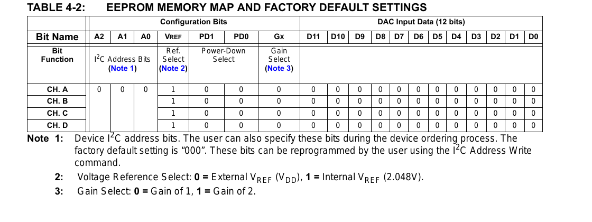

# MSOP10 — the threshold DAC

| | |
|---|---|
| Component | `THRESHOLD_DAC` |
| Manufacturer | Microchip Tech |
| Part number | `MCP4728T-E/UN` |
| LCSC | [C478093](https://www.lcsc.com/product-detail/C478093.html) |
| Footprint | `MSOP-10_3x3mm_P0.5mm` |

Quad 12-bit DAC, I²C, MSOP-10. Stock 21,498, read from JLCPCB's component API
on 2026-09-17.

Four channels for three thresholds - over-current in each direction, and the
DC link's over-voltage - with one spare on a test pad. All three phases share
one pair of current thresholds, which is what a symmetric limit means.

## Two things about this part that are not ideal

**Its reference is its supply.** The MCP4728 can use its own 2.048 V reference
or VDD, and neither is VREF+. The trip thresholds are therefore ratiometric to
the 3V3 rail while everything the ADCs measure is ratiometric to VREF+, so the
rail's ±5 % lands directly on every trip point.

That is acceptable for a protective limit — you set it well above the working
maximum anyway — and it is checked rather than assumed:
`checks/test_trip.py::test_the_trip_thresholds_are_as_accurate_as_they_claim`
works the rail band through to a tolerance and compares it against what the
board declares. Powering the DAC from VREF+ instead would make the ratio exact
and put I²C switching currents into the ADC reference, which is a worse trade.

**Its power-up value comes from EEPROM.** Microchip ships the part with the
factory default loaded, and this board depends on that default being zero - it
is what makes an unprogrammed board trip as it powers up. **Firmware must never
write the EEPROM**, only the input registers, or the board's power-up state
changes silently and permanently.

**Confirmed from Microchip's own table.**

DS22187E, Table 4-2: every channel ships with `D11..D0 = 0`, `VREF = 1`
(internal 2.048 V), `PD = 00`, gain 1, and I²C address bits `000`. Code zero on
all four outputs is exactly the power-up state the safety argument wants, and
it is now a picture rather than a hope.

**`VREF = 1` is the half that was missed.** `parts.py` stated for months that
the part's "output range is its supply", and that is only true after firmware
says so. Out of the box the reference is the internal **2.048 V**, which is
68 % of the 3.0 V that everything the sense chain delivers is ratiometric to.
Until the bit is written:

- the DC-link over-voltage trip cannot be placed above two thirds of the
  sensor's range;
- a phase over-current trip, which idles at mid-scale, cannot be placed above
  37 % of the positive half.

**So firmware must select the supply as the reference before clearing the trip
latch.** It is a Multi-Write to the *input* registers — not an EEPROM write,
which this part must never receive, because that is what would change the
power-up state. The power-up state itself stays safe either way: code zero is
zero volts on any reference, so an unprogrammed board still sits tripped.

`test_the_thresholds_can_reach_the_top_of_the_signal_range` holds the design to
the supply being enough, and asserts that the internal reference is *not* —
so the check stops being true the day someone decides the firmware write is
optional.

The earlier note said this datasheet was "a scanned-font PDF that no text
extraction here could read". It is not: `pdftotext` reads the whole document,
including this table and the pin table below. What was missing was a tool, not
a readable document.

## Pin mapping

Pin 1 VDD, 2 SCL, 3 SDA, 4 LDAC, 5 RDY/BSY, 6–9 VOUTA–VOUTD, 10 VSS.

That is Microchip's own Table 3-1, *Pin Function Table*, and it agrees with the
two sources this used to rest on — KiCad's `Analog_DAC:MCP4728` symbol and
LCSC's symbol data for C478093. `test_the_threshold_dac_is_wired_the_way_its_pin_table_says`
now asserts the netlist against it, including pin 5 by its *absence*: the
datasheet says to float RDY/BSY when it is unused, and this board does.

LDAC is tied low, so a write reaches the output when it lands; nothing here
needs four thresholds to change at one instant. RDY/BSY reports an EEPROM write
in progress and is deliberately left unconnected, because there will not be one.

**Footprint.** KiCad stock `Package_SO:MSOP-10_3x3mm_P0.5mm`, unmodified.
