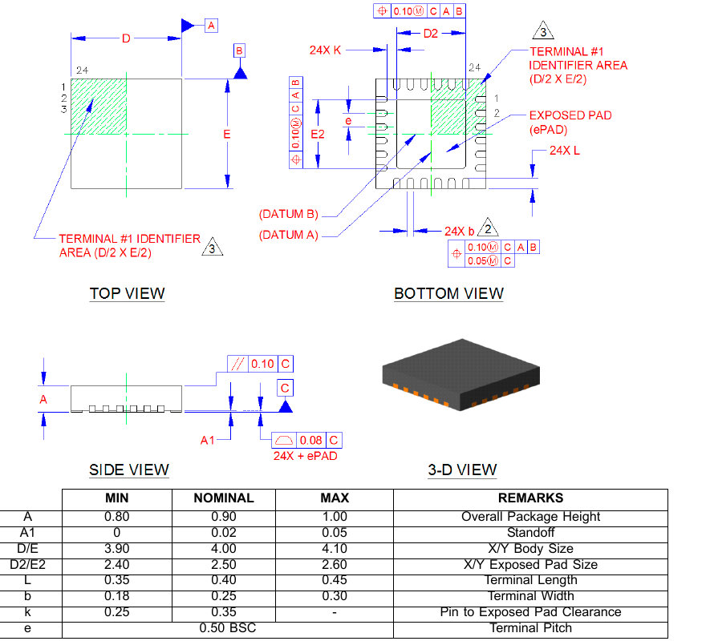

# QFN24 — the Ethernet PHY

| | |
|---|---|
| Component | `ETH_PHY` |
| Manufacturer | Microchip Tech |
| Part number | `LAN8742AI-CZ-TR` |
| LCSC | [C621425](https://www.lcsc.com/product-detail/C621425.html) |
| Footprint | `QFN-24-1EP_4x4mm_P0.5mm_EP2.5x2.5mm` |

RMII 10/100 transceiver with auto-MDIX. The **i** matters: the commercial part
stops at +70 °C, and this board sits in a motor drive. Stock 8,560, read from
JLCPCB's component API on 2026-09-17.

## How this datasheet was read

Microchip ships it **encrypted** — AES-128, standard security handler, owner
password set and the user password empty. That forbids printing and editing,
not reading, but every text extractor sees noise, and the first attempt here
produced zero characters from 132 pages.

The file key was computed the specification's way from `/O`, `/P` and the
document ID with an empty user password, and each stream handed to `openssl`
for the AES itself. Every figure below came out of the result. Two documents
were opened this way and it is worth naming both, because the first one was the
wrong part: `00002165B.pdf` is the **LAN8720A**, not the LAN8742A, and the two
share a pinout and a KiCad symbol but not their features.

The one used here is **SMSC's *LAN8742A/LAN8742Ai*, revision 1.1
(05-21-13)**, fetched as `8742a.pdf`.

## The clock decision, and what it costs

The plan called for a 25 MHz crystal in REF_CLK Out mode rather than a 50 MHz
oscillator. The datasheet grants that and charges for it, in its own words:

> When configured for REF_CLK Out Mode, the device generates the 50MHz RMII
> REF_CLK and the nINT interrupt is not available.

So **this board has no PHY interrupt**. `PG14` was reserved for one and is now
free; the pin map records why, and firmware learns about link changes by
reading the PHY over MDIO, which it does anyway whenever it wants the speed.

The strap that selects it is `nINTSEL`, on the LED2 pin, and it is the only
strap here that has to be fought: it defaults to the interrupt mode through an
internal pull-up, so a 10 kΩ to ground turns it around. Left alone, the PHY
comes up waiting for a reference clock nothing on this board generates, every
voltage correct and the interface silent.

## Straps that are decisions to fit nothing

| Strap | Pin | Default | Why that is what this board wants |
|---|---|---|---|
| `MODE[2:0]` | RXD0, RXD1, CRS_DV | 111, internal pull-ups | "All capable, auto-negotiation enabled" |
| `PHYAD0` | RXER | 0, internal pull-down | One PHY, address 0 |
| `REGOFF` | LED1 | pulled down internally | Pulled **down** turns the internal 1.2 V regulator **on** |

`test_ethernet.py` checks that nothing pulls any of them, because a decision to
fit no component leaves no trace in a schematic other than the absence itself.

**RXER is left unconnected** rather than wired to the MCU: the STM32's RMII has
no receive-error input, so after reset the pin has no job.

**No LEDs are driven from the PHY.** Both LED pins double as straps, and
Section 3.8.1 makes the LED polarity and the strap level interact. The board
has its own indicators and a debug port; the jack's LEDs, when the jack lands
in M7d, can be driven or left alone on their own merits.

## Figures used from the datasheet

| Figure | Value | Where |
|---|---|---|
| VDDIO | +1.62 V to +3.6 V | Operating Conditions |
| VDD1A, VDD2A | +3.0 V to +3.6 V | Operating Conditions |
| VDDCR (internal regulator) | +1.14 V to +1.26 V | Operating Conditions |
| Ethernet magnetics supply | +2.25 V to +3.6 V | Operating Conditions |
| VDDCR decoupling | 1 µF and 470 pF in parallel | Table 2.5, VDDCR |
| RBIAS | 12.1 kΩ ±1 % to ground, ≈1 mW | Table 2.5, RBIAS |
| Crystal | 25.000 MHz, AT cut, fundamental, parallel resonant | Table 5.16 |
| Crystal CL | 20 pF typ | Table 5.16 |
| Crystal ESR | 30 Ω max | Table 5.16 |
| XTAL1, XTAL2 pin capacitance | 3 pF typ each | Table 5.16, Note 5.20 |
| Total PPM budget | ±50 ppm, of which ≈±45 for tolerance and stability | Table 5.16, Note 5.15 |
| Exposed pad | 2.40 / 2.50 / 2.60 mm | Package Outline, D2/E2 |

**The exposed pad settles the footprint.** 2.50 mm nominal is exactly KiCad's
`EP2.5x2.5mm` variant, which is why that one and not the 2.15 or 2.65 mm
neighbours sitting beside it in the same library.

**Footprint.** KiCad stock
`Package_DFN_QFN:QFN-24-1EP_4x4mm_P0.5mm_EP2.5x2.5mm`, unmodified.

## The exposed pad

LAN8742A/LAN8742Ai Revision 1.1, Chapter 6. Body 4.00, terminal pitch 0.50 BSC,
exposed pad **2.40 / 2.50 / 2.60**, pin-to-pad clearance 0.25 minimum. KiCad's
`EP2.5x2.5` is the nominal exactly, and the body and pitch match.

**That chapter is the package outline and nothing else.** Microchip publish no
recommended land pattern for this part, no via pattern and no paste aperture —
the earlier note was right about that, and fetching the document confirms it
rather than leaving it open. So the two things the outline does not settle are
decisions, recorded here as decisions:

- **Four vias in the pad.** The pad is the part's only ground connection and
  its only path for heat, and the stitching generator gives any pad exactly
  one. Four is what TI draw inside the comparable PowerPAD on the LM5164, the
  one manufacturer on this board who publishes a figure; see
  [`../SO8EP/evidence/land_pattern.png`](../SO8EP/evidence/land_pattern.png).
  `test_every_exposed_pad_has_its_thermal_vias` holds every `-1EP` footprint on
  the board to it, and it is how the single via here was found.
- **The paste aperture is KiCad's**, and it is already segmented: four
  1.01 × 1.01 mm windows at ±0.625, which is 4.08 mm² of a 6.25 mm² pad, or
  65 % — inside the 50–80 % band IPC-7093 asks for, and low enough that the
  part will not float. The four vias sit in the gaps *between* those windows
  rather than under them, so none of them wicks paste away from the joint.

What remains unconfirmed is only whether Microchip would ask for something
different, which no document reachable from here says.
