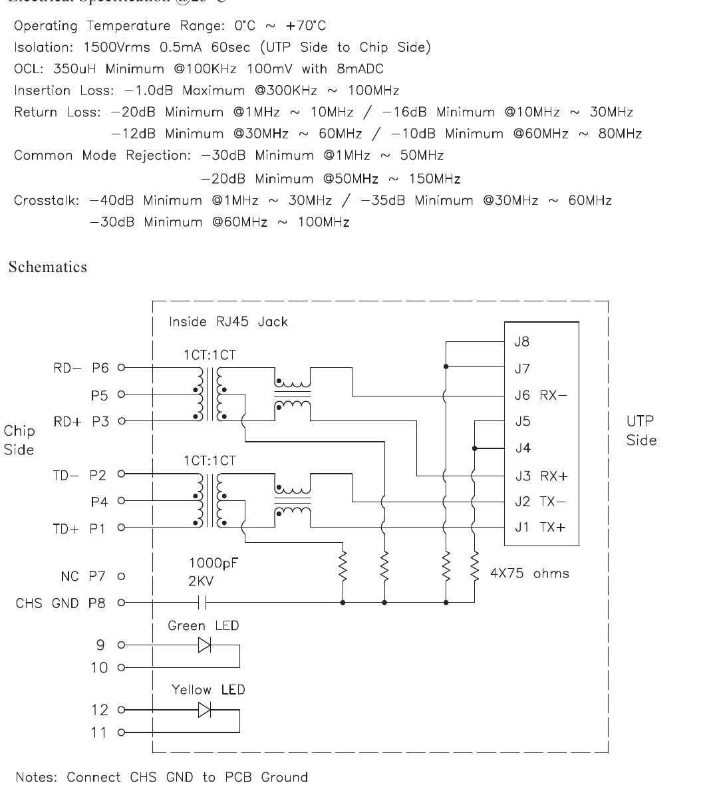

# RJ45HR — the Ethernet jack, with the magnetics inside it

| | |
|---|---|
| Component | `ETH_JACK` |
| Manufacturer | HANRUN |
| Part number | `HR911105A` |
| LCSC | [C12074](https://www.lcsc.com/product-detail/C12074.html) |
| Footprint | `RJ45_Hanrun_HR911105A_Horizontal` |

A 10/100 MagJack: the RJ45, the isolation transformers and the common-mode
chokes in one through-hole part, with four LEDs nobody drives. Stock 64,783,
read from JLCPCB's component API on 2026-09-17.

## Why this rather than a transformer and a jack

Same parts count, one fewer thing to get the isolation rating wrong on, and no
question about how far apart to keep the two sides of the barrier — the barrier
is inside the moulding. What it costs is choice: the turns ratio, the choke and
the termination network are all decided by the part number.

## It is why the board is 130 × 110 mm

19 mm by 22 mm, on an edge, and there was no square that size left on the
100 × 80 mm this design started at. Growing the board is the cheap side of that
trade — a larger panel is a few cents — and the alternative was an Ethernet
jack crowding the analog front end. The README called the size provisional and
this is what it was provisional for.

## The pin order is reversed inside each pair

The PHY's line pins run TXP, TXN, RXP, RXN from left to right. This jack's run
TD−, TD+ … RD−, RD+ once it is turned to face out of the board edge. The
*pairs* are in the same order; each pair is the other way round inside itself.

No arrangement of two tracks on one layer swaps two tracks, so each pair has to
cross once. The layout does it on the back copper, above the point where the
pair starts running parallel: two vias and a couple of millimetres of copper
facing the wrong plane, in the part of the route that has no controlled
impedance anyway.

**The alternative was to wire P to N and let the PHY correct it.** It very
probably would — 10BASE-T detects inverted link pulses, and most PHYs carry the
correction into 100BASE-TX. But "most PHYs" and "a feature firmware can switch
off" are not what a physical layer should rest on, so the crossing is drawn.

## Pin mapping

From KiCad's own symbol for this exact part, whose names are in the library
rather than inferred:

| Pin | Name | Here |
|---|---|---|
| 1 | TD+ | PHY TXP |
| 2 | TD− | PHY TXN |
| 3 | RD+ | PHY RXP |
| 4 | TCT | 3V3, with its own bypass |
| 5 | RCT | 3V3, with its own bypass |
| 6 | RD− | PHY RXN |
| 7 | NC | left unconnected |
| 8 | — | the common of the jack's own termination network, to ground |
| 9–12 | LEDs | left unconnected |
| SH | shell | to ground |

**The centre taps go to the supply, not to ground.** The LAN8742A's line driver
is current-mode: it pulls current out of the winding, and the tap is where that
current comes from. Taps on ground is what a voltage-mode PHY wants, and gives
this one a transmitter with nothing to drive against.

**Each tap gets its own capacitor.** The two windings switch at different
moments, and one shared bypass puts the transmit return through the receive
winding's tap.

**The LEDs are not driven.** Both of the PHY's LED pins double as configuration
straps, and buying two indicators at the price of a strap polarity each is a
poor trade on a board that already has three LEDs and a debug port.

## Figures used

HanRun's own datasheet, REV. A/2. All three of the things this note used to
list as unreadable are on that one page.

| Figure | Value | Where |
|---|---|---|
| Isolation | 1500 V rms, 0.5 mA, 60 s, UTP side to chip side | HanRun, Electrical Specification |
| Operating temperature | 0 to +70 °C | same |
| Rate | 10/100 Base-T, filtered, non-PoE | same |
| Termination | 4 × 75 Ω to a 1000 pF 2 kV capacitor, inside the jack | HanRun, Schematics |

**Pin 8 is CHS GND**, and the note under the schematic is an instruction:
*"Connect CHS GND to PCB Ground."* That is what the board does. Pin 7 is NC and
is left unconnected; P1/P2 are TD±, P3/P6 are RD±, and P4/P5 are the centre
taps, all as wired. `test_the_ethernet_jack_is_wired_the_way_hanrun_draws_it`
asserts the whole of that against the netlist.

**The 0 to +70 °C rating is confirmed, not resolved.** Every other part on this
board is the industrial grade and this one is not. Reading the datasheet turns
that from a thing nobody had checked into a thing that is true — a substitution
to make deliberately, on a board destined for a motor drive, rather than by
accident. It is not a question a document can settle.

**Footprint.** KiCad stock `Connector_RJ:RJ45_Hanrun_HR911105A_Horizontal`,
unmodified, drawn for this manufacturer's part by name.
