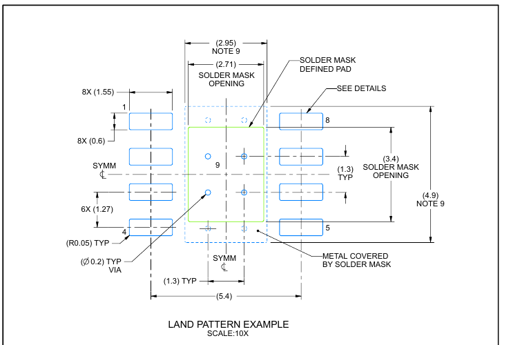

# SO8EP — the 100 V buck

| | |
|---|---|
| Component | `BUCK_100V` |
| Manufacturer | Texas Instruments |
| Part number | `LM5164DDAR` |
| LCSC | [C477928](https://www.lcsc.com/product-detail/C477928.html) |
| Footprint | `SOIC-8-1EP_3.9x4.9mm_P1.27mm_EP2.514x3.2mm` |

Constant-on-time synchronous buck, 6 to 100 V in, 1 A out, SO-8 with PowerPAD.
Stock 4,985, $1.97 at qty 1–9, read from JLCPCB's component API on 2026-09-17.

## Why a 100 V part on a 36 V rail

Not for the rail — for what protects it. A 40 V TVS clamps at 64.5 V, and a
60 V-class buck behind it has 7 % of margin. led12 shipped a regulator with
3 %, and `test_the_buck_is_rated_well_above_the_tvs_clamp` is the check that
came out of that. At 100 V this part has 1.55×.

## Figures used from the datasheet

TI's *LM5164*, SNVSAU4A (September 2018, revised January 2019), served by LCSC
for C477928.

| Figure | Value | Where |
|---|---|---|
| Input voltage | 6 to 100 V operating, 100 V absolute maximum | §6.1, §6.3 |
| Load current | 1 A nominal, 1.25 A maximum | §6.3 |
| Feedback voltage | 1.181 / 1.2 / 1.218 V | §6.5, FEEDBACK |
| On-time | 2550 ns at V_IN 12 V, R_RON 75 kΩ | §6.5, t_ON3 |
| Minimum on-time | 50 ns | §6.3 |
| Maximum frequency | 1 MHz | §6.3 |
| Peak current limit | 1.25 / 1.5 / 1.75 A | §6.5, CURRENT LIMIT |
| Enable threshold | 1.45 / 1.5 / 1.55 V rising | §6.5, EN/UVLO |
| Feedback ripple | 20 mV typical, 12 mV minimum at low line | §8.2.2.6 |
| Bootstrap capacitor | 1.5 to 2.5 nF | §6.1 |
| Input capacitance | 2.2 µF minimum, rated twice the input | §8.2.2.5 |
| PGOOD pull-up | 10 kΩ to 100 kΩ | Pin Functions, pin 6 |
| Exposed pad | no internal connection; solder to the GND pin | Pin Functions, EP |

## The on-time constant, and a datasheet figure that does not add up

The switching frequency is set by one resistor, and the equation that relates
them — Equation 11, and Equation 12 for R_RON — is a figure with no text layer.
It is reconstructed in `checks/test_power.py` from the characterised on-time at
12 V and 75 kΩ, as `t_on = k · R_on / V_in`.

Three of the datasheet's four on-times agree with the constant that implies:

| Condition | Stated | Implied by t_ON3 |
|---|---|---|
| 6 V, 75 kΩ | 5000 ns | 5100 ns |
| 6 V, 25 kΩ | **650 ns** | **1700 ns** |
| 12 V, 75 kΩ | 2550 ns | — |
| 12 V, 25 kΩ | 830 ns | 850 ns |

Section 8.2.2.2 gives an independent check: "a standard 100 kΩ, 1 % resistor
sets the switching frequency at 300 kHz" for a 12 V output, which is
k = 4.0 × 10⁻¹⁰ exactly, against the 4.08 × 10⁻¹⁰ that t_ON3 gives.

**t_ON2 agrees with nothing** — it is a quarter of what the other three and the
worked example imply, and reads like a dropped digit. The checks use t_ON3, the
point nearest this board's operating conditions, and no value here depends on
t_ON2.

## Ripple injection, and the one value nothing checks

This is a constant-on-time converter: it regulates on a comparator, and a
comparator needs a slope at the feedback pin. With ceramic output capacitors
there is none worth having, so the board uses the Type 3 network from §8.2.2.6
— R12 and C16 from the switch node to the output, coupled in by C17 — which is
what TI's own reference design uses.

Equations 24 to 26 are figures with no text layer. The ripple amplitude is
re-derived in `checks/test_power.py` from the network itself and checked
against the datasheet's own worked example, which it reproduces to three
figures. **Equation 26, which sets the coupling capacitor C17, is not
reconstructed**: 56 pF is the value TI's reference design uses with the same
3.3 nF ramp capacitor, and `checks/config.py` records that nothing bounds it.

**Equation 26, read.** TI state it as
`CB >= t_TR-settling / (3 x RFB1)`, where *t* is the *desired* load-transient
settling time — so it does not give a value, it converts a requirement into
one. With this board's 158 kΩ top resistor, the fitted 56 pF satisfies it for
any settling time up to **26.5 µs**.

That is worth knowing, because 56 pF was taken from TI's reference design and
TI's divider is 446 kΩ, where the same 56 pF buys 75 µs. The value did not
scale with the divider. Nothing on this board states a transient requirement,
so there is no defect to point at — but if one is ever stated above 26.5 µs,
C17 is the part that has to grow, and `checks/config.py` now records that
rather than recording that nothing bounds it at all.

## Footprint and the exposed pad

KiCad stock `Package_SO:SOIC-8-1EP_3.9x4.9mm_P1.27mm_EP2.514x3.2mm`, unmodified.

**Confirmed against TI's own land pattern.**

SNVSAU4D, page 29. Eight 1.55 × 0.6 pads on a 1.27 mm pitch; the thermal pad's
solder-mask opening 2.71 × 3.4 with metal 2.95 × 4.9; and **four 0.2 mm vias on
a 1.3 mm grid inside it**.

KiCad's 2.514 × 3.20 exposed pad is smaller than TI's 2.71 × 3.4 opening, as is
LCSC's 2.50 × 3.20 — less thermal area than TI asks for, which is the direction
that costs temperature rise rather than shorts. The lead pitch, lead span and
body size all match.

The four vias are the part of that drawing this board now enforces:
`test_every_exposed_pad_has_its_thermal_vias` counts vias inside every
`-1EP` footprint's largest pad. It found the Ethernet PHY with one.

## Pin mapping

KiCad's `Regulator_Switching:LM5164DDA`. Its pin names and numbers — 1 GND,
2 VIN, 3 EN/UVLO, 4 RON, 5 FB, 6 PGOOD, 7 BST, 8 SW, 9 EP — match the
datasheet's Pin Functions table exactly, which was read in full. No doubt here.
