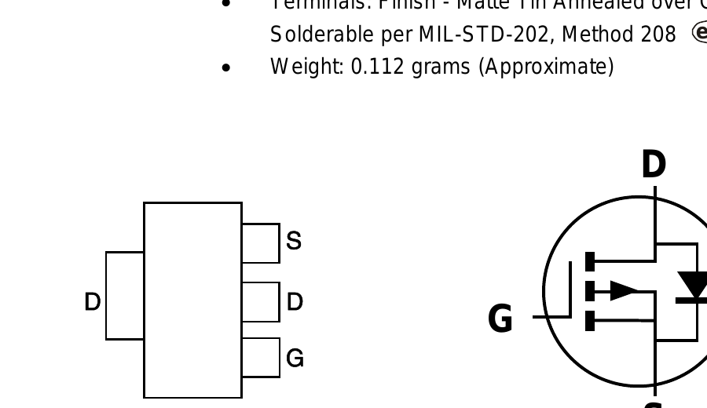
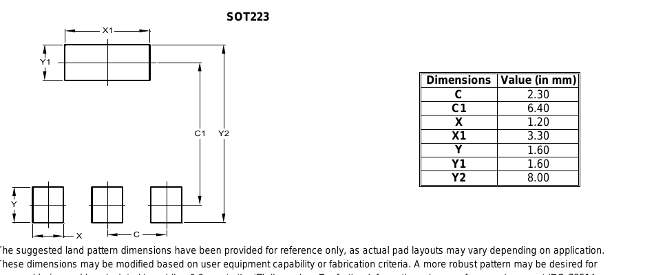

# SOT223 — the reverse-polarity FET

| | |
|---|---|
| Component | `PFET_RPP` |
| Manufacturer | Diodes Incorporated |
| Part number | `DMP10H400SE-13` |
| LCSC | [C156277](https://www.lcsc.com/product-detail/C156277.html) |
| Footprint | `SOT-223-3_TabPin2` |

100 V P-channel MOSFET, 250 mΩ, 2.3 A, SOT-223. Stock 3,042, read from JLCPCB's
component API on 2026-09-17.

## Why 100 V, and why not a SOT-23

The TVS on this board sits **behind** the FET, on the protected rail. That is
deliberate: with the TVS in front, a reversed supply forward-biases it into a
short and takes the fuse with it, which makes the FET pointless. Behind it,
reversing the terminal does nothing at all — and the FET holds off the whole
input, with nothing clamping a negative transient below it.

So the FET is rated for the input reversed, at twice the 36 V it must block.
`test_the_reverse_polarity_fet_blocks_the_whole_input` is that rule.

The 100 V P-channel parts in SOT-23 are all about 1 Ω — at half an amp that is
a quarter of a watt in a package rated for 0.6 W, and a half-volt drop off a
9 V input. SOT-223 at 250 mΩ costs board area and nothing else.

## Figures used from the datasheet

Diodes' *DMP10H400SE*, DS37841 Rev. 3-2 (November 2015), served by LCSC for
C156277.

| Figure | Value | Where |
|---|---|---|
| Drain-source voltage | −100 V | Maximum ratings |
| Gate-source voltage | ±20 V | Maximum ratings |
| Continuous drain current | −2.3 A at T_A = +25 °C | Maximum ratings |
| On-resistance | 250 mΩ max at V_GS = −10 V | On characteristics |
| Gate threshold | −1.0 / −2.2 / −3.0 V | On characteristics |

## Pin mapping

Pin 1 gate, pin 2 drain, pin 3 source, and the tab is pin 2 as well — which is
why the symbol is `Transistor_FET:Q_PMOS_GDS` and the footprint is the TabPin2
variant.

**Confirmed against the manufacturer's own drawing.**

Diodes' DS37841 Rev. 3-2, page 1, under *Mechanical Data*: the tab is **D**,
and the three leads are **S, D, G** in that order along the opposite side.
`evidence/sources.json` records the URL and the SHA-256 of the file that was
rendered.

That drawing carries no pin *numbers*, and neither does Diodes' SOT223 package
information sheet — so the numbers cannot simply be read off. They do not have
to be. Both drawings below are top views, and two top views fix the numbering
between them, but **not without appealing to any convention** - which is what this used to claim, and what its own `evidence/sources.json` contradicts under `assumes`:

| with the tab pointing away from the viewer | left to right |
|---|---|
| Diodes' top view, turned so the tab is up | G, D, S |
| KiCad's `SOT-223-3_TabPin2`, turned so the tab is up | 1, 2, 3 |

so **1 = G, 2 = D, 3 = S**, and the tab is D. That agrees with LCSC's symbol
for C156277, which was the only source before, and it now agrees with it for a
reason rather than by assertion.

`test_reverse_polarity_fets_face_the_supply` is what holds the other half: it
takes which pad is the drain from the symbol's own pin names and the supply
side from whatever the fuse feeds, so a part with a different pin order is
caught rather than accommodated.

## The land pattern

Diodes' *SOT223 Package Information*, Rev. 2017-03-06. Lead pads 1.20 × 1.60 on
a 2.30 mm pitch, tab 3.30 × 1.60, 8.00 mm across the outside. KiCad's footprint
uses 2.0 × 1.5 pads on the same 2.30 pitch with a 2.0 × 3.8 tab, 8.30 across —
more copper in every direction than the manufacturer asks for, which is the
direction to err in for a hand-soldered prototype.

The board routes lead and tab together down the middle of the package, because
KiCad gives them one number and the netlist one net, but each is a pad and DRC
counts them separately.

**Footprint.** KiCad stock `Package_TO_SOT_SMD:SOT-223-3_TabPin2`, unmodified.

## The convention this rests on, stated plainly

Neither drawing carries pin numbers. That 1 = G, 2 = D, 3 = S rests on the
JEDEC convention that numbering runs left to right with the tab away from the
viewer, and the "second top view" that appeared to corroborate it is KiCad's
own `SOT-223-3_TabPin2` footprint - a library's encoding of the same
convention, not an independent drawing. `evidence/sources.json` has said so
under `assumes` all along; this note said the opposite.

It matters more here than anywhere else on the board: this is the
reverse-polarity FET, and it is the part this project already had backwards
once. What actually holds it is
`test_reverse_polarity_fets_face_the_supply`, which derives the orientation
from the netlist - whatever net the fuse feeds is the supply side, and that is
the net the drain must be on - and from the letters in the symbol's own name.
That check does not depend on this convention at all, and it is the reason to
believe the orientation rather than the drawing.
