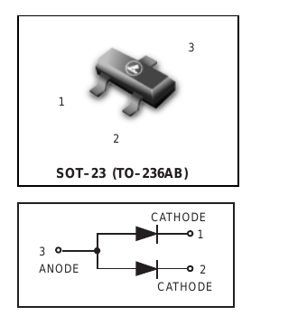

# SOT23 — the voltage reference and the trip-bus diodes

| | |
|---|---|
| Component | `VREF_3V0` `SCHOTTKY_DUAL` |
| Manufacturer | Texas Instruments / LRC |
| Part number | `REF3030AIDBZR, LBAT54ALT1G` |
| LCSC | [C38423](https://www.lcsc.com/product-detail/C38423.html) |
| Footprint | `SOT-23` |

3.000 V series reference, ±0.2 %, 75 ppm/°C, 50 µA quiescent, SOT-23-3.
Stock 15,700, read from JLCPCB's component API on 2026-09-17.

## Why a reference at all

Everything this board measures is a ratio
of VREF+. Deriving it from the 3V3 rail would make every measurement a
measurement of the switching regulator, and the MCU's own VREFBUF is specified
in percent, not in parts per million. This part's 0.2 % initial error and
75 ppm/°C drift are the board's measurement accuracy, and they are the two
numbers to quote when anyone asks what the current sensing is worth.

3.0 V and not 3.3: VREF+ may not exceed VDDA, and VDDA is the logic rail less
the drop across its ferrite. A 3.3 V reference on a 3.3 V rail has no headroom
at all, and `test_the_reference_is_below_the_analog_supply_it_sits_under`
compares the reference's highest against the rail's lowest.

## Figures used from the datasheet

TI's *REF3012, 3020, 3025, 3030, 3033, 3040*, SBVS032F (March 2002, revised
August 2008), served by LCSC for C38423.

| Figure | Value | Where |
|---|---|---|
| Output voltage | 2.994 / 3.0 / 3.006 V | Electrical characteristics, 3.0 V |
| Supply voltage | V_OUT + 1 mV to 5.5 V | Electrical characteristics, power supply |
| Absolute maximum supply | 7.0 V | Absolute maximum ratings |
| Output current | 25 mA | Features |
| Drift | 75 ppm/°C maximum, −40 to +125 °C | Features |
| Supply bypass | 0.47 µF recommended | Application information |

**No output capacitor is required**, and one is allowed: the datasheet's only
caution about capacitive loading is against low-ESR capacitance on the 1.25 V
member of the family, which it bounds at 10 µF. The 1 µF and 100 nF on VREF+
are the MCU's decoupling, not this part's.

## Pin mapping

Pin 1 IN, pin 2 OUT, pin 3 GND, read from the package drawing on page 1 of the
datasheet, which is text and not an image. KiCad's `Reference_Voltage:REF3030`
inherits the same numbering from `REF3012`. Two sources, agreeing: no doubt
here.

**Footprint.** KiCad stock `Package_TO_SOT_SMD:SOT-23`, unmodified.

## The trip-bus diodes

`LBAT54ALT1G`, [C12743](https://www.lcsc.com/product-detail/C12743.html), a
BAT54A: two Schottky diodes with their **anodes joined**, 30 V, 200 mA, in the
same SOT-23. Stock 255,381. Two of them on the board.

They are what lets three separate things pull the trip bus low without any of
them being wired to each other. Each fault line reaches the bus through its own
diode and keeps its own net all the way to the MCU pin that reports it; reset
reaches it the same way, without the bus being able to pull on NRST in return.

| Figure | Value | Where |
|---|---|---|
| Forward voltage | 0.22 / 0.24 V at 0.1 mA | Electrical characteristics |
| | 0.29 / 0.32 V at 1 mA | |
| Reverse voltage | 30 V | Maximum ratings |
| Forward current | 200 mA | Maximum ratings |

**Schottky, not silicon, and this is the reason.** The latch calls anything
under 0.8 V a low. A fault output sitting at 0.4 V plus 0.24 V across the diode
leaves the bus at 0.64 V, which is a low with 0.16 V to spare. A silicon
diode's 0.7 V would put it at 1.1 V, and the latch would never see the fault at
all. `test_the_trip_bus_reaches_a_valid_low_through_its_diodes` is that
sentence as a check.

## Pin mapping for the BAT54A

Pins 1 and 2 are the cathodes and pin 3 the common anode, from the datasheet's
own marking diagram ("3 ANODE, CATHODE 1, 2 CATHODE").

Leshan Radio's LBAT54ALT1G datasheet, Rev. C: the numbered package on the left
and the internal circuit on the right, which draws **pin 3 as the common ANODE
and pins 1 and 2 as the two CATHODEs**. That is the datasheet's own schematic,
not its marking table, and it settles the thing that matters — a common-cathode
part fitted here would tie both fault lines together, and the board would look
right until two faults arrived.
