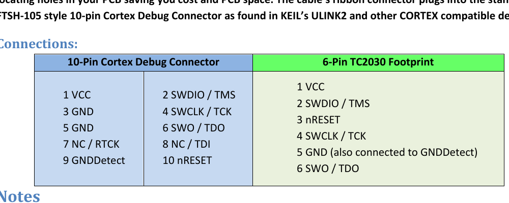

# TC2030 — SWD debug footprint

| | |
|---|---|
| Component | `TAG_CONNECT` |
| Manufacturer | Tag-Connect |
| Part number | `TC2030-IDC-NL` |
| LCSC | n/a |
| Footprint | `Tag-Connect_TC2030-IDC-NL_2x03_P1.27mm_Vertical` |

Not a part on the board: six pads and three locating holes that the
Tag-Connect cable's pogo pins press against. Nothing is fitted, nothing is
ordered, and it takes the area of a few small resistors. The cable itself is
bought once, for the bench.

| Pad | Signal |
|---|---|
| 1 | VCC (3V3, for the probe's level sensing) |
| 2 | SWDIO |
| 3 | NRST |
| 4 | SWCLK |
| 5 | GND |
| 6 | SWO |

**Confirmed against Tag-Connect's own table.**

The TC2030-CTX datasheet lists the six-pin footprint as 1 VCC, 2 SWDIO/TMS,
3 nRESET, 4 SWCLK/TCK, 5 GND, 6 SWO/TDO - which is what the table above says,
and what KiCad's `Connector:Conn_ARM_SWD_TagConnect_TC2030` symbol gives. It is
published as text rather than drawn, so
`test_the_debug_pads_are_wired_the_way_the_cable_is` asserts the netlist
against it instead of anyone reading it once. The footprint carries a keepout under the
pads - no vias, no copper pour - which the layout engine moves with it.

**NL: no legs.** The cable is held by hand or a clip, not latched through the
board, so there are no retention holes to route around.

**Footprint.** KiCad stock `Connector:Tag-Connect_TC2030-IDC-NL_2x03_P1.27mm_Vertical`,
unmodified.
