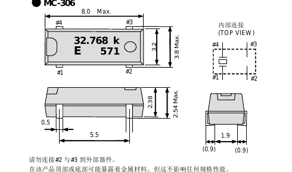

# XTAL_MC306 — 32.768 kHz crystal

| | |
|---|---|
| Component | `XTAL_32K` |
| Manufacturer | Seiko Epson |
| Part number | `Q13MC30620006` |
| LCSC | [C83979](https://www.lcsc.com/product-detail/C83979.html) |
| Footprint | `Crystal_SMD_SeikoEpson_MC306-4Pin_8.0x3.2mm` |

32.768 kHz, **6 pF load**, 8.0 × 3.2 mm. Extended, stock 22,497, $0.32. Listing
from JLCPCB's API on 2026-09-17; from Epson's MC-306 datasheet, served by LCSC:
**ESR 50 kΩ maximum, shunt capacitance 0.85 pF typical**.

## Chosen on gain margin

The H743's LSE offers at most 2.7 µA/V, at its highest drive setting
(LSEDRV = 11, datasheet Table 44). With the common 12.5 pF parts that is a
margin barely above one — it would start on the bench and not reliably cold. A
6 pF load and this ESR give a margin of **6.8** at the datasheet's maximum ESR.
Firmware must select high drive.

The Abracon ABS07 (C1985240), in a smaller two-pad package, leaves its shunt
capacitance blank in its datasheet, so its margin could not be shown.

## Pins

Epson's datasheet: terminals #2 and #3 are internally connected and **must not
be connected to anything external**. The crystal is between #1 and #4. KiCad's
`Device:Crystal_GND23` symbol matches: pins 1 and 4 are the crystal, 2 and 3
are left unconnected in the design.

**Confirmed against Epson's own drawing.**

The outline puts **#4 top-left, #3 top-right, #1 bottom-left, #2 bottom-right**,
and the *internal connection (top view)* beside it draws the crystal between
**#1 and #4** — the two pads at one end — with #2 and #3 as the case. KiCad's
`Crystal_SMD_SeikoEpson_MC306-4Pin_8.0x3.2mm` places pad 1 at (-2.75, +1.6) and
pad 4 at (-2.75, -1.6): the same two pads, the same end.

The caption underneath is an instruction, not a note: *do not connect #2 and #3
to external devices*. Grounding a crystal can is common enough elsewhere to be
a reflex, so `test_the_32khz_crystal_leaves_its_case_pads_alone` asserts that
this board has not.

**Footprint.** KiCad stock `Crystal:Crystal_SMD_SeikoEpson_MC306-4Pin_8.0x3.2mm`,
unmodified.
