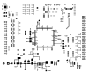
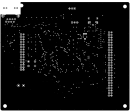
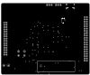
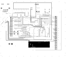
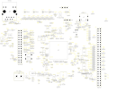
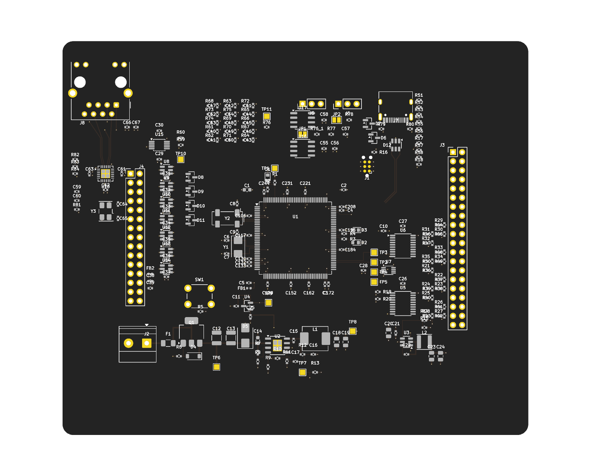
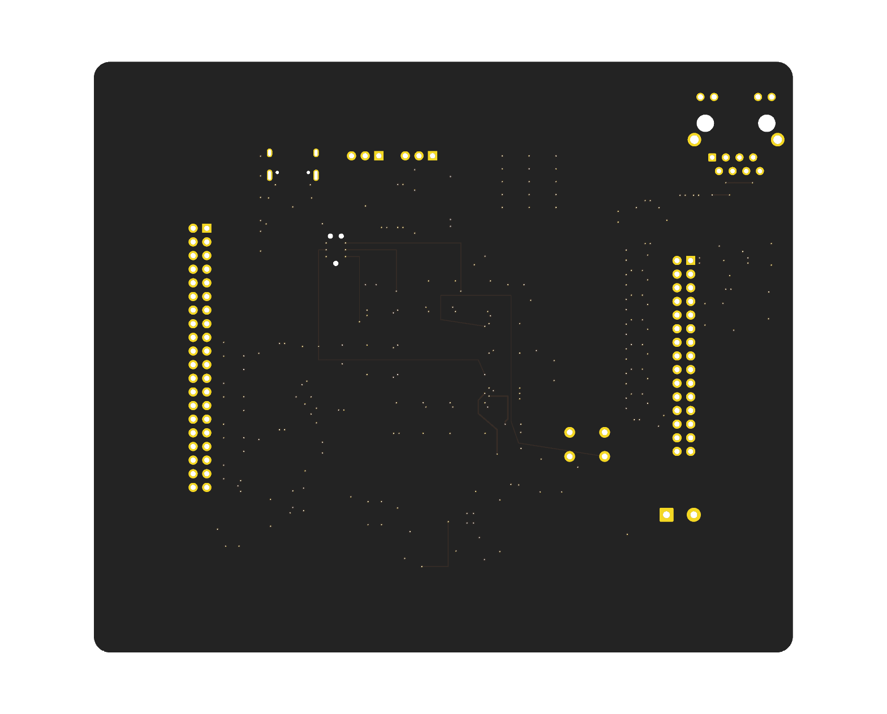

# cpu1 — the STM32H743 control board

One STM32H743ZIT6 generating every hard real-time signal - PWM,
PWM-synchronised sampling, the hardware trip - for a purely analog power board
soldered underneath it. This is the board as it stands, plotted from the same
`.kicad_pcb` the fab package is built from.

|  |  |
|---|---|
| **Size** | 130 × 110 mm |
| **Stackup** | 4 layers — F.Cu / In1.Cu / In2.Cu / B.Cu |
| **Footprints** | 228 |
| **Nets** | 191, of which 8 pending |
| **Routing** | 425 track segments, 259 vias, 3 zones |
| **DRC** | 0 violations, 243 connections not yet routed (`ROUTING := incomplete`) |

> [!IMPORTANT]
> **Routing is deliberately incomplete.** Read the plots with that in
> mind, and see *What these pictures are not*, at the end.

## The copper, one layer at a time

Plotted separately rather than stacked: a stacked plot of a board with
3 filled zones is a solid rectangle. The layer list is read from
the board file rather than written down here, for the same reason the gerber
list is — a fixed `F.Cu,B.Cu` list silently leaves a 4-layer board's planes out.

### `F.Cu`

The component side. Dense around the LQFP-144's escapes and the two regulators; sparse above them, where the safety chain, the comparators and the buses are placed but not yet joined up. The two pairs in the top-left corner are the Ethernet link, and the only tracks on this board drawn to an impedance rather than a width.

### `In1.Cu`

One solid ground plane, notched at the top-left corner where the Ethernet jack's cable end sits. **No AGND/DGND split anywhere on this board** - analog is kept together by placement instead, which is a decision recorded in the plan rather than a habit.

Zones on this layer: `GND`

### `In2.Cu`

Power islands. 3V3 fills most of the layer; the 5 V island inside it is a higher-priority zone, so it wins the overlap. That is what lets the two share a layer without a hand-drawn boundary between them.

Zones on this layer: `3V3`, `5V`

### `B.Cu`

The solder side, nearly empty. Placement is single-sided for this spin, so the back carries only what had to change layer to escape the package.

### Assembly

Silkscreen over the fabrication layer: every designator, every courtyard, and the board outline. This is the drawing to check a part against before ordering.

## Renders

| Top | Bottom |
|---|---|
|  |  |
| single-sided placement | vias and through-hole pads only |

## What is on the board

Every part belongs to one block, named by the address it is built under in
`cpu1.py` — so this grouping is the design's own, not a reading of the
schematic after the fact.

| Block | Parts | What it is |
|---|---|---|
| MCU core | 40 | The package, both crystals, reset and boot, the Tag-Connect pad, and a decoupling capacitor for every supply pin. |
| Input protection | 6 | Terminal, fuse, reverse-polarity FET with its gate Zener, and the TVS whose clamp voltage the buck has to outlive. |
| 100 V buck | 17 | LM5164 constant-on-time buck to 5 V, rated far above that clamp - a 60 V part here would be the regulator defect from led12 again. |
| 3V3 buck | 9 | TPS562200 down to the logic rail. |
| Analog supply | 3 | 5VA and its ferrite, for the sensors on the power board. |
| Reference | 2 | 3.0 V series reference into VREF+, buffered out to the analog header. |
| Safety chain | 51 | Two octal buffers and the hardware latch. Nothing reaches a gate driver unless firmware has deliberately allowed it, and a reset takes the permission away. |
| Trip comparators | 23 | Seven TLV3501s and the threshold DAC, which powers up at zero - so an unprogrammed board trips as it powers up rather than switching. |
| ADC networks | 31 | One RC per channel, sized from both ends: low enough to stop the switching node aliasing into the measurement, high enough to recharge inside the sampling window. |
| CAN FD | 8 | TCAN1044V with split termination on a solder jumper. |
| RS-485 | 5 | THVD1450, fail-safe biased on-chip, 120 ohm on a jumper. |
| USB-C | 4 | A device port that senses VBUS and takes no power from it. The board's one differential pair, drawn to 90 ohm from the stackup rather than to a width somebody remembered. |
| Ethernet | 16 | The LAN8742A, a 25 MHz crystal it multiplies up to make the RMII reference clock, the straps that decide it should, and a jack with the magnetics inside it. The board grew to 130 by 110 mm to hold the jack. |
| Headers | 2 | Digital 2x20 and analog 2x15 to the power board. |
| Test points | 11 | A pad on every rail and on the signals bring-up needs. |

<strong>Every footprint</strong> — all 228, by block

#### MCU core

| Ref | Address | Value | Part number | LCSC | Footprint |
|---|---|---|---|---|---|
| `R1` | `core.boot0.pulldown` | 10k | 0402WGF1002TCE | C25744 | `R_0402_1005Metric` |
| `C1` | `core.bulk` | 4.7uF | CL10A475KO8NNNC | C19666 | `C_0603_1608Metric` |
| `R5` | `core.button.pulldown` | 10k | 0402WGF1002TCE | C25744 | `R_0402_1005Metric` |
| `SW1` | `core.button.switch` | 6mm | K2-1102DP-C4SW-04 | C110153 | `SW_PUSH_6mm` |
| `C208` | `core.dec.p108` | 100nF | CL05B104KO5NNNC | C1525 | `C_0402_1005Metric` |
| `C221` | `core.dec.p121` | 100nF | CL05B104KO5NNNC | C1525 | `C_0402_1005Metric` |
| `C231` | `core.dec.p131` | 100nF | CL05B104KO5NNNC | C1525 | `C_0402_1005Metric` |
| `C244` | `core.dec.p144` | 100nF | CL05B104KO5NNNC | C1525 | `C_0402_1005Metric` |
| `C117` | `core.dec.p17` | 100nF | CL05B104KO5NNNC | C1525 | `C_0402_1005Metric` |
| `C130` | `core.dec.p30` | 100nF | CL05B104KO5NNNC | C1525 | `C_0402_1005Metric` |
| `C132` | `core.dec.p32` | 100nF | CL05B104KO5NNNC | C1525 | `C_0402_1005Metric` |
| `C133` | `core.dec.p33` | 100nF | CL05B104KO5NNNC | C1525 | `C_0402_1005Metric` |
| `C139` | `core.dec.p39` | 100nF | CL05B104KO5NNNC | C1525 | `C_0402_1005Metric` |
| `C152` | `core.dec.p52` | 100nF | CL05B104KO5NNNC | C1525 | `C_0402_1005Metric` |
| `C106` | `core.dec.p6` | 100nF | CL05B104KO5NNNC | C1525 | `C_0402_1005Metric` |
| `C162` | `core.dec.p62` | 100nF | CL05B104KO5NNNC | C1525 | `C_0402_1005Metric` |
| `C172` | `core.dec.p72` | 100nF | CL05B104KO5NNNC | C1525 | `C_0402_1005Metric` |
| `C184` | `core.dec.p84` | 100nF | CL05B104KO5NNNC | C1525 | `C_0402_1005Metric` |
| `C195` | `core.dec.p95` | 100nF | CL05B104KO5NNNC | C1525 | `C_0402_1005Metric` |
| `C6` | `core.hse.c_in` | 8.2pF | 0402CG8R2C500NT | C1579 | `C_0402_1005Metric` |
| `C7` | `core.hse.c_out` | 8.2pF | 0402CG8R2C500NT | C1579 | `C_0402_1005Metric` |
| `Y1` | `core.hse.crystal` | 8MHz | L0153G28000F08DTNJ | C5221298 | `Crystal_SMD_5032-2Pin_5.0x3.2mm` |
| `D3` | `core.led.comms.led` | yellow-green | KT-0603YG | C2289 | `LED_0603_1608Metric` |
| `R4` | `core.led.comms.resistor` | 1k | 0402WGF1001TCE | C11702 | `R_0402_1005Metric` |
| `D2` | `core.led.fault.led` | red | KT-0603R | C2286 | `LED_0603_1608Metric` |
| `R3` | `core.led.fault.resistor` | 1k | 0402WGF1001TCE | C11702 | `R_0402_1005Metric` |
| `D1` | `core.led.status.led` | yellow-green | KT-0603YG | C2289 | `LED_0603_1608Metric` |
| `R2` | `core.led.status.resistor` | 1k | 0402WGF1001TCE | C11702 | `R_0402_1005Metric` |
| `C8` | `core.lse.c_in` | 6.8pF | 0402CG6R8C500NT | C1576 | `C_0402_1005Metric` |
| `C9` | `core.lse.c_out` | 6.8pF | 0402CG6R8C500NT | C1576 | `C_0402_1005Metric` |
| `Y2` | `core.lse.crystal` | 32.768kHz | Q13MC30620006 | C83979 | `Crystal_SMD_SeikoEpson_MC306-4Pin_8.0x3.2mm` |
| `C10` | `core.nrst.cap` | 100nF | CL05B104KO5NNNC | C1525 | `C_0402_1005Metric` |
| `J1` | `core.swd` | SWD | TC2030-IDC-NL | — | `Tag-Connect_TC2030-IDC-NL_2x03_P1.27mm_Vertical` |
| `C2` | `core.usb_bulk` | 1uF | CL05A105KA5NQNC | C52923 | `C_0402_1005Metric` |
| `C4` | `core.vcap.p106` | 2.2uF | CL05A225MQ5NSNC | C12530 | `C_0402_1005Metric` |
| `C3` | `core.vcap.p71` | 2.2uF | CL05A225MQ5NSNC | C12530 | `C_0402_1005Metric` |
| `FB1` | `core.vdda.bead` | 600R | GZ1005D601TF | C14182 | `L_0402_1005Metric` |
| `C5` | `core.vdda.c1u` | 1uF | CL05A105KA5NQNC | C52923 | `C_0402_1005Metric` |
| `C11` | `core.vref.c1u` | 1uF | CL05A105KA5NQNC | C52923 | `C_0402_1005Metric` |
| `U1` | `mcu` | STM32H743ZIT6 | STM32H743ZIT6 | C114408 | `LQFP-144_20x20mm_P0.5mm` |

#### Input protection

| Ref | Address | Value | Part number | LCSC | Footprint |
|---|---|---|---|---|---|
| `D4` | `power.d_gate_clamp` | 15V | BZT52C15 | C2104 | `D_SOD-123` |
| `F1` | `power.fuse` | 1A | 0468001.NRHF | C45157 | `Fuse_1206_3216Metric` |
| `Q1` | `power.q_rpp` | DMP10H400SE | DMP10H400SE-13 | C156277 | `SOT-223-3_TabPin2` |
| `R6` | `power.r_gate` | 100k | 0402WGF1003TCE | C25741 | `R_0402_1005Metric` |
| `J2` | `power.terminal` | 9-36V | WJ500V-5.08-2P | C8465 | `TerminalBlock_Phoenix_MKDS-1,5-2-5.08_1x02_P5.08mm_Horizontal` |
| `D5` | `power.tvs` | SMBJ40A | SMBJ40A | C152095 | `D_SMB` |

#### 100 V buck

| Ref | Address | Value | Part number | LCSC | Footprint |
|---|---|---|---|---|---|
| `C15` | `buck5.c_bst` | 2.2nF | CC0402KRX7R9BB222 | C106861 | `C_0402_1005Metric` |
| `C17` | `buck5.c_couple` | 56pF | 0402CG560J500NT | C1572 | `C_0402_1005Metric` |
| `C12` | `buck5.c_in1` | 2.2uF | CL32B225KCJSNNE | C55151 | `C_1210_3225Metric` |
| `C13` | `buck5.c_in2` | 2.2uF | CL32B225KCJSNNE | C55151 | `C_1210_3225Metric` |
| `C14` | `buck5.c_in_hf` | 100nF | CC0603KRX7R0BB104 | C113803 | `C_0603_1608Metric` |
| `C18` | `buck5.c_out1` | 10uF | CL21A106KAYNNNE | C15850 | `C_0805_2012Metric` |
| `C19` | `buck5.c_out2` | 10uF | CL21A106KAYNNNE | C15850 | `C_0805_2012Metric` |
| `C16` | `buck5.c_ramp` | 3.3nF | CC0402KRX7R9BB332 | C107028 | `C_0402_1005Metric` |
| `U2` | `buck5.ic` | LM5164 | LM5164DDAR | C477928 | `SOIC-8-1EP_3.9x4.9mm_P1.27mm_EP2.514x3.2mm` |
| `L1` | `buck5.inductor` | 33uH | MWSA0603S-330MT | C408454 | `L_Sunlord_MWSA0603S` |
| `R11` | `buck5.r_fb_bottom` | 49.9k | 0402WGF4992TCE | C25897 | `R_0402_1005Metric` |
| `R10` | `buck5.r_fb_top` | 158k | 0402WGF1583TCE | C99856 | `R_0402_1005Metric` |
| `R9` | `buck5.r_on` | 31.6k | 0402WGF3162TCE | C11463 | `R_0402_1005Metric` |
| `R13` | `buck5.r_pgood` | 49.9k | 0402WGF4992TCE | C25897 | `R_0402_1005Metric` |
| `R12` | `buck5.r_ramp` | 121k | 0402WGF1213TCE | C11693 | `R_0402_1005Metric` |
| `R8` | `buck5.r_uvlo_bottom` | 49.9k | 0402WGF4992TCE | C25897 | `R_0402_1005Metric` |
| `R7` | `buck5.r_uvlo_top` | 226k | 0402WGF2263TCE | C26999 | `R_0402_1005Metric` |

#### 3V3 buck

| Ref | Address | Value | Part number | LCSC | Footprint |
|---|---|---|---|---|---|
| `C22` | `buck3v3.c_bst` | 100nF | CL05B104KO5NNNC | C1525 | `C_0402_1005Metric` |
| `C20` | `buck3v3.c_in` | 10uF | CL21A106KAYNNNE | C15850 | `C_0805_2012Metric` |
| `C21` | `buck3v3.c_in_hf` | 100nF | CL05B104KO5NNNC | C1525 | `C_0402_1005Metric` |
| `C23` | `buck3v3.c_out1` | 22uF | CGA0805X7R226M100MT | C23692981 | `C_0805_2012Metric` |
| `C24` | `buck3v3.c_out2` | 22uF | CGA0805X7R226M100MT | C23692981 | `C_0805_2012Metric` |
| `U3` | `buck3v3.ic` | TPS562200 | TPS562200DDCR | C49757 | `TSOT-23-6` |
| `L2` | `buck3v3.inductor` | 3.3uH | SWPA4030S3R3MT | C15269 | `L_Sunlord_SWPA4030S` |
| `R15` | `buck3v3.r_fb_bottom` | 10k | 0402WGF1002TCE | C25744 | `R_0402_1005Metric` |
| `R14` | `buck3v3.r_fb_top` | 33.2k | 0402WGF3322TCE | C122548 | `R_0402_1005Metric` |

#### Analog supply

| Ref | Address | Value | Part number | LCSC | Footprint |
|---|---|---|---|---|---|
| `FB2` | `analog.bead` | 600R | GZ1005D601TF | C14182 | `L_0402_1005Metric` |
| `C38` | `analog.bulk` | 1uF | CL05A105KA5NQNC | C52923 | `C_0402_1005Metric` |
| `C39` | `analog.decoupling` | 100nF | CL05B104KO5NNNC | C1525 | `C_0402_1005Metric` |

#### Reference

| Ref | Address | Value | Part number | LCSC | Footprint |
|---|---|---|---|---|---|
| `C25` | `vref.c_in` | 1uF | CL05A105KA5NQNC | C52923 | `C_0402_1005Metric` |
| `U4` | `vref.ic` | REF3030 | REF3030AIDBZR | C38423 | `SOT-23` |

#### Safety chain

| Ref | Address | Value | Part number | LCSC | Footprint |
|---|---|---|---|---|---|
| `U5` | `safety.buffer1` | 74LVC541A | SN74LVC541APWR | C113281 | `TSSOP-20_4.4x6.5mm_P0.65mm` |
| `C26` | `safety.buffer1.decoupling` | 100nF | CL05B104KO5NNNC | C1525 | `C_0402_1005Metric` |
| `U6` | `safety.buffer2` | 74LVC541A | SN74LVC541APWR | C113281 | `TSSOP-20_4.4x6.5mm_P0.65mm` |
| `C27` | `safety.buffer2.decoupling` | 100nF | CL05B104KO5NNNC | C1525 | `C_0402_1005Metric` |
| `D6` | `safety.d_faults` | BAT54A | LBAT54ALT1G | C12743 | `SOT-23` |
| `D7` | `safety.d_reset` | BAT54A | LBAT54ALT1G | C12743 | `SOT-23` |
| `U7` | `safety.latch` | 74LVC1G74 | SN74LVC1G74DCUR | C70285 | `VSSOP-8_2.3x2mm_P0.5mm` |
| `C28` | `safety.latch.decoupling` | 100nF | CL05B104KO5NNNC | C1525 | `C_0402_1005Metric` |
| `R43` | `safety.pulldown.gate_enable_out` | 10k | 0402WGF1002TCE | C25744 | `R_0402_1005Metric` |
| `R41` | `safety.pulldown.pwm1_a_high_out` | 10k | 0402WGF1002TCE | C25744 | `R_0402_1005Metric` |
| `R42` | `safety.pulldown.pwm1_a_low_out` | 10k | 0402WGF1002TCE | C25744 | `R_0402_1005Metric` |
| `R39` | `safety.pulldown.pwm1_b_high_out` | 10k | 0402WGF1002TCE | C25744 | `R_0402_1005Metric` |
| `R40` | `safety.pulldown.pwm1_b_low_out` | 10k | 0402WGF1002TCE | C25744 | `R_0402_1005Metric` |
| `R36` | `safety.pulldown.pwm1_brake_out` | 10k | 0402WGF1002TCE | C25744 | `R_0402_1005Metric` |
| `R37` | `safety.pulldown.pwm1_c_high_out` | 10k | 0402WGF1002TCE | C25744 | `R_0402_1005Metric` |
| `R38` | `safety.pulldown.pwm1_c_low_out` | 10k | 0402WGF1002TCE | C25744 | `R_0402_1005Metric` |
| `R47` | `safety.pulldown.pwm2_a_high_out` | 10k | 0402WGF1002TCE | C25744 | `R_0402_1005Metric` |
| `R48` | `safety.pulldown.pwm2_a_low_out` | 10k | 0402WGF1002TCE | C25744 | `R_0402_1005Metric` |
| `R46` | `safety.pulldown.pwm2_b_high_out` | 10k | 0402WGF1002TCE | C25744 | `R_0402_1005Metric` |
| `R50` | `safety.pulldown.pwm2_b_low_out` | 10k | 0402WGF1002TCE | C25744 | `R_0402_1005Metric` |
| `R45` | `safety.pulldown.pwm2_c_high_out` | 10k | 0402WGF1002TCE | C25744 | `R_0402_1005Metric` |
| `R49` | `safety.pulldown.pwm2_c_low_out` | 10k | 0402WGF1002TCE | C25744 | `R_0402_1005Metric` |
| `R44` | `safety.pulldown.pwm2_pfc_out` | 10k | 0402WGF1002TCE | C25744 | `R_0402_1005Metric` |
| `R52` | `safety.pulldown.relay_main` | 10k | 0402WGF1002TCE | C25744 | `R_0402_1005Metric` |
| `R51` | `safety.pulldown.relay_precharge` | 10k | 0402WGF1002TCE | C25744 | `R_0402_1005Metric` |
| `R57` | `safety.pulldown.sto1_feedback` | 10k | 0402WGF1002TCE | C25744 | `R_0402_1005Metric` |
| `R58` | `safety.pulldown.sto2_feedback` | 10k | 0402WGF1002TCE | C25744 | `R_0402_1005Metric` |
| `R53` | `safety.pullup.id_strap0` | 10k | 0402WGF1002TCE | C25744 | `R_0402_1005Metric` |
| `R54` | `safety.pullup.id_strap1` | 10k | 0402WGF1002TCE | C25744 | `R_0402_1005Metric` |
| `R55` | `safety.pullup.id_strap2` | 10k | 0402WGF1002TCE | C25744 | `R_0402_1005Metric` |
| `R56` | `safety.pullup.id_strap3` | 10k | 0402WGF1002TCE | C25744 | `R_0402_1005Metric` |
| `R20` | `safety.r_clear_pullup` | 10k | 0402WGF1002TCE | C25744 | `R_0402_1005Metric` |
| `R19` | `safety.r_enable_pullup` | 10k | 0402WGF1002TCE | C25744 | `R_0402_1005Metric` |
| `R17` | `safety.r_fault1_pullup` | 10k | 0402WGF1002TCE | C25744 | `R_0402_1005Metric` |
| `R18` | `safety.r_fault2_pullup` | 10k | 0402WGF1002TCE | C25744 | `R_0402_1005Metric` |
| `R16` | `safety.r_trip_pullup` | 10k | 0402WGF1002TCE | C25744 | `R_0402_1005Metric` |
| `R28` | `safety.series.gate_enable` | 33R | 0402WGF330JTCE | C25105 | `R_0402_1005Metric` |
| `R26` | `safety.series.pwm1_a_high` | 33R | 0402WGF330JTCE | C25105 | `R_0402_1005Metric` |
| `R27` | `safety.series.pwm1_a_low` | 33R | 0402WGF330JTCE | C25105 | `R_0402_1005Metric` |
| `R24` | `safety.series.pwm1_b_high` | 33R | 0402WGF330JTCE | C25105 | `R_0402_1005Metric` |
| `R25` | `safety.series.pwm1_b_low` | 33R | 0402WGF330JTCE | C25105 | `R_0402_1005Metric` |
| `R21` | `safety.series.pwm1_brake` | 33R | 0402WGF330JTCE | C25105 | `R_0402_1005Metric` |
| `R22` | `safety.series.pwm1_c_high` | 33R | 0402WGF330JTCE | C25105 | `R_0402_1005Metric` |
| `R23` | `safety.series.pwm1_c_low` | 33R | 0402WGF330JTCE | C25105 | `R_0402_1005Metric` |
| `R32` | `safety.series.pwm2_a_high` | 33R | 0402WGF330JTCE | C25105 | `R_0402_1005Metric` |
| `R33` | `safety.series.pwm2_a_low` | 33R | 0402WGF330JTCE | C25105 | `R_0402_1005Metric` |
| `R31` | `safety.series.pwm2_b_high` | 33R | 0402WGF330JTCE | C25105 | `R_0402_1005Metric` |
| `R35` | `safety.series.pwm2_b_low` | 33R | 0402WGF330JTCE | C25105 | `R_0402_1005Metric` |
| `R30` | `safety.series.pwm2_c_high` | 33R | 0402WGF330JTCE | C25105 | `R_0402_1005Metric` |
| `R34` | `safety.series.pwm2_c_low` | 33R | 0402WGF330JTCE | C25105 | `R_0402_1005Metric` |
| `R29` | `safety.series.pwm2_pfc` | 33R | 0402WGF330JTCE | C25105 | `R_0402_1005Metric` |

#### Trip comparators

| Ref | Address | Value | Part number | LCSC | Footprint |
|---|---|---|---|---|---|
| `D8` | `trip.d_outputs1` | BAT54A | LBAT54ALT1G | C12743 | `SOT-23` |
| `D9` | `trip.d_outputs2` | BAT54A | LBAT54ALT1G | C12743 | `SOT-23` |
| `D10` | `trip.d_outputs3` | BAT54A | LBAT54ALT1G | C12743 | `SOT-23` |
| `D11` | `trip.d_outputs4` | BAT54A | LBAT54ALT1G | C12743 | `SOT-23` |
| `U15` | `trip.dac` | MCP4728 | MCP4728T-E/UN | C478093 | `MSOP-10_3x3mm_P0.5mm` |
| `C30` | `trip.dac.bulk` | 1uF | CL05A105KA5NQNC | C52923 | `C_0402_1005Metric` |
| `C29` | `trip.dac.decoupling` | 100nF | CL05B104KO5NNNC | C1525 | `C_0402_1005Metric` |
| `U8` | `trip.ia_high` | TLV3501 | TLV3501AIDBVR | C193413 | `SOT-23-6` |
| `C31` | `trip.ia_high.decoupling` | 100nF | CL05B104KO5NNNC | C1525 | `C_0402_1005Metric` |
| `U9` | `trip.ia_low` | TLV3501 | TLV3501AIDBVR | C193413 | `SOT-23-6` |
| `C32` | `trip.ia_low.decoupling` | 100nF | CL05B104KO5NNNC | C1525 | `C_0402_1005Metric` |
| `U10` | `trip.ib_high` | TLV3501 | TLV3501AIDBVR | C193413 | `SOT-23-6` |
| `C33` | `trip.ib_high.decoupling` | 100nF | CL05B104KO5NNNC | C1525 | `C_0402_1005Metric` |
| `U11` | `trip.ib_low` | TLV3501 | TLV3501AIDBVR | C193413 | `SOT-23-6` |
| `C34` | `trip.ib_low.decoupling` | 100nF | CL05B104KO5NNNC | C1525 | `C_0402_1005Metric` |
| `U12` | `trip.ic_high` | TLV3501 | TLV3501AIDBVR | C193413 | `SOT-23-6` |
| `C35` | `trip.ic_high.decoupling` | 100nF | CL05B104KO5NNNC | C1525 | `C_0402_1005Metric` |
| `U13` | `trip.ic_low` | TLV3501 | TLV3501AIDBVR | C193413 | `SOT-23-6` |
| `C36` | `trip.ic_low.decoupling` | 100nF | CL05B104KO5NNNC | C1525 | `C_0402_1005Metric` |
| `R59` | `trip.r_scl_pullup` | 4.7k | 0402WGF4701TCE | C25900 | `R_0402_1005Metric` |
| `R60` | `trip.r_sda_pullup` | 4.7k | 0402WGF4701TCE | C25900 | `R_0402_1005Metric` |
| `U14` | `trip.vdc_high` | TLV3501 | TLV3501AIDBVR | C193413 | `SOT-23-6` |
| `C37` | `trip.vdc_high.decoupling` | 100nF | CL05B104KO5NNNC | C1525 | `C_0402_1005Metric` |

#### ADC networks

| Ref | Address | Value | Part number | LCSC | Footprint |
|---|---|---|---|---|---|
| `R68` | `adc.aux_fast.series` | 10R | 0402WGF100JTCE | C25077 | `R_0402_1005Metric` |
| `C47` | `adc.aux_fast.shunt` | 10nF | CC0402KRX7R9BB103 | C60133 | `C_0402_1005Metric` |
| `R73` | `adc.board_id1.series` | 1k | 0402WGF1001TCE | C11702 | `R_0402_1005Metric` |
| `C52` | `adc.board_id1.shunt` | 100nF | CL05B104KO5NNNC | C1525 | `C_0402_1005Metric` |
| `R74` | `adc.board_id2.series` | 1k | 0402WGF1001TCE | C11702 | `R_0402_1005Metric` |
| `C53` | `adc.board_id2.shunt` | 100nF | CL05B104KO5NNNC | C1525 | `C_0402_1005Metric` |
| `R76` | `adc.dac_test.series` | 1k | 0402WGF1001TCE | C11702 | `R_0402_1005Metric` |
| `R61` | `adc.ia.series` | 10R | 0402WGF100JTCE | C25077 | `R_0402_1005Metric` |
| `C40` | `adc.ia.shunt` | 10nF | CC0402KRX7R9BB103 | C60133 | `C_0402_1005Metric` |
| `R62` | `adc.ib.series` | 10R | 0402WGF100JTCE | C25077 | `R_0402_1005Metric` |
| `C41` | `adc.ib.shunt` | 10nF | CC0402KRX7R9BB103 | C60133 | `C_0402_1005Metric` |
| `R63` | `adc.ic.series` | 10R | 0402WGF100JTCE | C25077 | `R_0402_1005Metric` |
| `C42` | `adc.ic.shunt` | 10nF | CC0402KRX7R9BB103 | C60133 | `C_0402_1005Metric` |
| `R75` | `adc.ov_comp.series` | 10R | 0402WGF100JTCE | C25077 | `R_0402_1005Metric` |
| `C54` | `adc.ov_comp.shunt` | 10nF | CC0402KRX7R9BB103 | C60133 | `C_0402_1005Metric` |
| `R69` | `adc.slow1.series` | 1k | 0402WGF1001TCE | C11702 | `R_0402_1005Metric` |
| `C48` | `adc.slow1.shunt` | 100nF | CL05B104KO5NNNC | C1525 | `C_0402_1005Metric` |
| `R70` | `adc.slow2.series` | 1k | 0402WGF1001TCE | C11702 | `R_0402_1005Metric` |
| `C49` | `adc.slow2.shunt` | 100nF | CL05B104KO5NNNC | C1525 | `C_0402_1005Metric` |
| `R71` | `adc.slow3.series` | 1k | 0402WGF1001TCE | C11702 | `R_0402_1005Metric` |
| `C50` | `adc.slow3.shunt` | 100nF | CL05B104KO5NNNC | C1525 | `C_0402_1005Metric` |
| `R72` | `adc.slow4.series` | 1k | 0402WGF1001TCE | C11702 | `R_0402_1005Metric` |
| `C51` | `adc.slow4.shunt` | 100nF | CL05B104KO5NNNC | C1525 | `C_0402_1005Metric` |
| `R65` | `adc.va.series` | 10R | 0402WGF100JTCE | C25077 | `R_0402_1005Metric` |
| `C44` | `adc.va.shunt` | 10nF | CC0402KRX7R9BB103 | C60133 | `C_0402_1005Metric` |
| `R66` | `adc.vb.series` | 10R | 0402WGF100JTCE | C25077 | `R_0402_1005Metric` |
| `C45` | `adc.vb.shunt` | 10nF | CC0402KRX7R9BB103 | C60133 | `C_0402_1005Metric` |
| `R67` | `adc.vc.series` | 10R | 0402WGF100JTCE | C25077 | `R_0402_1005Metric` |
| `C46` | `adc.vc.shunt` | 10nF | CC0402KRX7R9BB103 | C60133 | `C_0402_1005Metric` |
| `R64` | `adc.vdc.series` | 10R | 0402WGF100JTCE | C25077 | `R_0402_1005Metric` |
| `C43` | `adc.vdc.shunt` | 10nF | CC0402KRX7R9BB103 | C60133 | `C_0402_1005Metric` |

#### CAN FD

| Ref | Address | Value | Part number | LCSC | Footprint |
|---|---|---|---|---|---|
| `C55` | `can.decoupling_vcc` | 100nF | CL05B104KO5NNNC | C1525 | `C_0402_1005Metric` |
| `C56` | `can.decoupling_vio` | 100nF | CL05B104KO5NNNC | C1525 | `C_0402_1005Metric` |
| `J5` | `can.header` | bus | PZ254-1-03-Z-8.5 | C2894926 | `PinHeader_1x03_P2.54mm_Vertical` |
| `JP1` | `can.termination_jumper` | open | SOLDER-JUMPER-2 | — | `SolderJumper-2_P1.3mm_Open_Pad1.0x1.5mm` |
| `R77` | `can.termination_lower` | 60R4 | 0402WGF604JTCE | C60310 | `R_0402_1005Metric` |
| `C57` | `can.termination_split` | 4.7nF | 0402B472K500NT | C1538 | `C_0402_1005Metric` |
| `R76_1` | `can.termination_upper` | 60R4 | 0402WGF604JTCE | C60310 | `R_0402_1005Metric` |
| `U16` | `can.transceiver` | TCAN1044V | TCAN1044VDRQ1 | C1852061 | `SOIC-8_3.9x4.9mm_P1.27mm` |

#### RS-485

| Ref | Address | Value | Part number | LCSC | Footprint |
|---|---|---|---|---|---|
| `C58` | `rs485.decoupling` | 100nF | CL05B104KO5NNNC | C1525 | `C_0402_1005Metric` |
| `J6` | `rs485.header` | bus | PZ254-1-03-Z-8.5 | C2894926 | `PinHeader_1x03_P2.54mm_Vertical` |
| `R78` | `rs485.termination` | 120R | 0402WGF1200TCE | C25079 | `R_0402_1005Metric` |
| `JP2` | `rs485.termination_jumper` | open | SOLDER-JUMPER-2 | — | `SolderJumper-2_P1.3mm_Open_Pad1.0x1.5mm` |
| `U17` | `rs485.transceiver` | THVD1450 | THVD1450DR | C2671361 | `SOIC-8_3.9x4.9mm_P1.27mm` |

#### USB-C

| Ref | Address | Value | Part number | LCSC | Footprint |
|---|---|---|---|---|---|
| `R79` | `usb.cc1_pulldown` | 5K1 | 0402WGF5101TCE | C25905 | `R_0402_1005Metric` |
| `R80` | `usb.cc2_pulldown` | 5K1 | 0402WGF5101TCE | C25905 | `R_0402_1005Metric` |
| `D12` | `usb.protection` | USBLC6-2 | USBLC6-2SC6 | C7519 | `SOT-23-6` |
| `J7` | `usb.receptacle` | USB-C | TYPE-C-31-M-12 | C165948 | `USB_C_Receptacle_HRO_TYPE-C-31-M-12` |

#### Ethernet

| Ref | Address | Value | Part number | LCSC | Footprint |
|---|---|---|---|---|---|
| `R81` | `eth.bias` | 12K1 | 0402WGF1212TCE | C25852 | `R_0402_1005Metric` |
| `C59` | `eth.core_bulk` | 1uF | CL05A105KA5NQNC | C52923 | `C_0402_1005Metric` |
| `C60` | `eth.core_hf` | 470pF | 0402CG471J500NT | C75274 | `C_0402_1005Metric` |
| `C62` | `eth.dec_vdd1a` | 100nF | CL05B104KO5NNNC | C1525 | `C_0402_1005Metric` |
| `C63` | `eth.dec_vdd2a` | 100nF | CL05B104KO5NNNC | C1525 | `C_0402_1005Metric` |
| `C61` | `eth.dec_vddio` | 100nF | CL05B104KO5NNNC | C1525 | `C_0402_1005Metric` |
| `J8` | `eth.jack` | RJ45 | HR911105A | C12074 | `RJ45_Hanrun_HR911105A_Horizontal` |
| `U18` | `eth.phy` | LAN8742Ai | LAN8742AI-CZ-TR | C621425 | `QFN-24-1EP_4x4mm_P0.5mm_EP2.5x2.5mm` |
| `R82` | `eth.r_mdio_pullup` | 4.7k | 0402WGF4701TCE | C25900 | `R_0402_1005Metric` |
| `R84` | `eth.r_refclk_strap` | 10k | 0402WGF1002TCE | C25744 | `R_0402_1005Metric` |
| `R83` | `eth.r_reset_pullup` | 10k | 0402WGF1002TCE | C25744 | `R_0402_1005Metric` |
| `C66` | `eth.tap_bypass1` | 100nF | CL05B104KO5NNNC | C1525 | `C_0402_1005Metric` |
| `C67` | `eth.tap_bypass2` | 100nF | CL05B104KO5NNNC | C1525 | `C_0402_1005Metric` |
| `C64` | `eth.xtal.c_in` | 33pF | 0402CG330J500NT | C1562 | `C_0402_1005Metric` |
| `C65` | `eth.xtal.c_out` | 33pF | 0402CG330J500NT | C1562 | `C_0402_1005Metric` |
| `Y3` | `eth.xtal.crystal` | 25MHz | TXM25M0004503LDCDO00T | C362363 | `Crystal_SMD_5032-4Pin_5.0x3.2mm` |

#### Headers

| Ref | Address | Value | Part number | LCSC | Footprint |
|---|---|---|---|---|---|
| `J4` | `header.analog` | analog | PZ254-2-15-Z-8.5 | C3012255 | `PinHeader_2x15_P2.54mm_Vertical` |
| `J3` | `header.digital` | digital | PZ254-2-20-Z-8.5 | C2894981 | `PinHeader_2x20_P2.54mm_Vertical` |

#### Test points

| Ref | Address | Value | Part number | LCSC | Footprint |
|---|---|---|---|---|---|
| `TP5` | `tp_3v3` | TP | TP-1.5MM | — | `TestPoint_Pad_1.5x1.5mm` |
| `TP8` | `tp_5v` | TP | TP-1.5MM | — | `TestPoint_Pad_1.5x1.5mm` |
| `TP1` | `tp_boot0` | TP | TP-1.5MM | — | `TestPoint_Pad_1.5x1.5mm` |
| `TP3` | `tp_console_rx` | TP | TP-1.5MM | — | `TestPoint_Pad_1.5x1.5mm` |
| `TP2` | `tp_console_tx` | TP | TP-1.5MM | — | `TestPoint_Pad_1.5x1.5mm` |
| `TP10` | `tp_dac_spare` | TP | TP-1.5MM | — | `TestPoint_Pad_1.5x1.5mm` |
| `TP11` | `tp_dac_test` | TP | TP-1.5MM | — | `TestPoint_Pad_1.5x1.5mm` |
| `TP4` | `tp_gnd` | TP | TP-1.5MM | — | `TestPoint_Pad_1.5x1.5mm` |
| `TP7` | `tp_pgood` | TP | TP-1.5MM | — | `TestPoint_Pad_1.5x1.5mm` |
| `TP6` | `tp_vin` | TP | TP-1.5MM | — | `TestPoint_Pad_1.5x1.5mm` |
| `TP9` | `tp_vref` | TP | TP-1.5MM | — | `TestPoint_Pad_1.5x1.5mm` |

## Nets

8 of the 191 nets are ERC waivers: each has exactly one
connection, because the block at its other end is not drawn yet. A check
requires that to stay true, so when the block lands the waiver has to go.

| Waiting on | Nets |
|---|---|
| M8: the motion-feedback connector, once the encoder type is settled | `ENC_A`, `ENC_B`, `ENC_SERIAL_RX`, `ENC_SERIAL_TX`, `ENC_Z`, `HALL_1`, `HALL_2`, `HALL_3` |

<strong>Every net</strong> — all 191, by size

| Net | Nodes | Status |
|---|--:|---|
| `GND` | 194 |  |
| `3V3` | 75 |  |
| `5V` | 29 |  |
| `VIN` | 9 |  |
| `TRIP_SET_N` | 8 |  |
| `USB_VBUS` | 6 |  |
| `VREF+` | 6 |  |
| `5VA` | 5 |  |
| `FAULT1_N` | 4 |  |
| `FAULT2_N` | 4 |  |
| `FB_5V` | 4 |  |
| `IA_SENSE` | 4 |  |
| `IB_SENSE` | 4 |  |
| `IC_SENSE` | 4 |  |
| `I_TRIP_HIGH` | 4 |  |
| `I_TRIP_LOW` | 4 |  |
| `NRST` | 4 |  |
| `PWM_ENABLE_N` | 4 |  |
| `SW_5V` | 4 |  |
| `VDC_SENSE` | 4 |  |
| `VDDA` | 4 |  |
| `AUX_FAST` | 3 |  |
| `BOARD_ID1` | 3 |  |
| `BOARD_ID2` | 3 |  |
| `BOOT0` | 3 |  |
| `BUTTON` | 3 |  |
| `CAN_H` | 3 |  |
| `CAN_L` | 3 |  |
| `CAN_TERM_MID` | 3 |  |
| `DAC_SCL` | 3 |  |
| `DAC_SDA` | 3 |  |
| `ETH_MDIO` | 3 |  |
| `ETH_PHY_RESET` | 3 |  |
| `ETH_VDDCR` | 3 |  |
| `ETH_XTAL1` | 3 |  |
| `ETH_XTAL2` | 3 |  |
| `FB_3V3` | 3 |  |
| `GATE_ENABLE_OUT` | 3 |  |
| `HSE_IN` | 3 |  |
| `HSE_OUT` | 3 |  |
| `IA` | 3 |  |
| `IB` | 3 |  |
| `IC` | 3 |  |
| `ID_STRAP0` | 3 |  |
| `ID_STRAP1` | 3 |  |
| `ID_STRAP2` | 3 |  |
| `ID_STRAP3` | 3 |  |
| `LSE_IN` | 3 |  |
| `LSE_OUT` | 3 |  |
| `OV_COMP` | 3 |  |
| `PGOOD` | 3 |  |
| `PWM1_A_HIGH_OUT` | 3 |  |
| `PWM1_A_LOW_OUT` | 3 |  |
| `PWM1_BRAKE_OUT` | 3 |  |
| `PWM1_B_HIGH_OUT` | 3 |  |
| `PWM1_B_LOW_OUT` | 3 |  |
| `PWM1_C_HIGH_OUT` | 3 |  |
| `PWM1_C_LOW_OUT` | 3 |  |
| `PWM2_A_HIGH_OUT` | 3 |  |
| `PWM2_A_LOW_OUT` | 3 |  |
| `PWM2_B_HIGH_OUT` | 3 |  |
| `PWM2_B_LOW_OUT` | 3 |  |
| `PWM2_C_HIGH_OUT` | 3 |  |
| `PWM2_C_LOW_OUT` | 3 |  |
| `PWM2_PFC_OUT` | 3 |  |
| `RAMP` | 3 |  |
| `RELAY_MAIN` | 3 |  |
| `RELAY_PRECHARGE` | 3 |  |
| `RPP_GATE` | 3 |  |
| `RS485_A` | 3 |  |
| `RS485_B` | 3 |  |
| `SLOW1` | 3 |  |
| `SLOW2` | 3 |  |
| `SLOW3` | 3 |  |
| `SLOW4` | 3 |  |
| `STO1_FEEDBACK` | 3 |  |
| `STO2_FEEDBACK` | 3 |  |
| `SW_3V3` | 3 |  |
| `TRIPPED` | 3 |  |
| `TRIP_CLEAR_N` | 3 |  |
| `TRIP_N` | 3 |  |
| `USB_DM_CABLE` | 3 |  |
| `USB_DP_CABLE` | 3 |  |
| `UVLO` | 3 |  |
| `VA` | 3 |  |
| `VB` | 3 |  |
| `VC` | 3 |  |
| `VDC` | 3 |  |
| `AUX_FAST_SENSE` | 2 |  |
| `BOARD_ID1_SENSE` | 2 |  |
| `BOARD_ID2_SENSE` | 2 |  |
| `BST_3V3` | 2 |  |
| `BST_5V` | 2 |  |
| `CAN_RX` | 2 |  |
| `CAN_STANDBY` | 2 |  |
| `CAN_TERM` | 2 |  |
| `CAN_TX` | 2 |  |
| `CONSOLE_RX` | 2 |  |
| `CONSOLE_TX` | 2 |  |
| `DAC_SPARE` | 2 |  |
| `DAC_TEST` | 2 |  |
| `DAC_TEST_OUT` | 2 |  |
| `ETH_CRS_DV` | 2 |  |
| `ETH_MDC` | 2 |  |
| `ETH_NINTSEL` | 2 |  |
| `ETH_RBIAS` | 2 |  |
| `ETH_RD_N` | 2 |  |
| `ETH_RD_P` | 2 |  |
| `ETH_REF_CLK` | 2 |  |
| `ETH_RXD0` | 2 |  |
| `ETH_RXD1` | 2 |  |
| `ETH_TD_N` | 2 |  |
| `ETH_TD_P` | 2 |  |
| `ETH_TXD0` | 2 |  |
| `ETH_TXD1` | 2 |  |
| `ETH_TX_EN` | 2 |  |
| `GATE_ENABLE` | 2 |  |
| `GATE_ENABLE_B` | 2 |  |
| `LED_COMMS` | 2 |  |
| `LED_COMMS_A` | 2 |  |
| `LED_FAULT` | 2 |  |
| `LED_FAULT_A` | 2 |  |
| `LED_STATUS` | 2 |  |
| `LED_STATUS_A` | 2 |  |
| `PWM1_A_HIGH` | 2 |  |
| `PWM1_A_HIGH_B` | 2 |  |
| `PWM1_A_LOW` | 2 |  |
| `PWM1_A_LOW_B` | 2 |  |
| `PWM1_BRAKE` | 2 |  |
| `PWM1_BRAKE_B` | 2 |  |
| `PWM1_B_HIGH` | 2 |  |
| `PWM1_B_HIGH_B` | 2 |  |
| `PWM1_B_LOW` | 2 |  |
| `PWM1_B_LOW_B` | 2 |  |
| `PWM1_C_HIGH` | 2 |  |
| `PWM1_C_HIGH_B` | 2 |  |
| `PWM1_C_LOW` | 2 |  |
| `PWM1_C_LOW_B` | 2 |  |
| `PWM2_A_HIGH` | 2 |  |
| `PWM2_A_HIGH_B` | 2 |  |
| `PWM2_A_LOW` | 2 |  |
| `PWM2_A_LOW_B` | 2 |  |
| `PWM2_B_HIGH` | 2 |  |
| `PWM2_B_HIGH_B` | 2 |  |
| `PWM2_B_LOW` | 2 |  |
| `PWM2_B_LOW_B` | 2 |  |
| `PWM2_C_HIGH` | 2 |  |
| `PWM2_C_HIGH_B` | 2 |  |
| `PWM2_C_LOW` | 2 |  |
| `PWM2_C_LOW_B` | 2 |  |
| `PWM2_PFC` | 2 |  |
| `PWM2_PFC_B` | 2 |  |
| `RON` | 2 |  |
| `RS485_DE` | 2 |  |
| `RS485_RX` | 2 |  |
| `RS485_TERM` | 2 |  |
| `RS485_TX` | 2 |  |
| `SLOW1_SENSE` | 2 |  |
| `SLOW2_SENSE` | 2 |  |
| `SLOW3_SENSE` | 2 |  |
| `SLOW4_SENSE` | 2 |  |
| `SWCLK` | 2 |  |
| `SWDIO` | 2 |  |
| `SWO` | 2 |  |
| `TRIP_IA_HIGH` | 2 |  |
| `TRIP_IA_LOW` | 2 |  |
| `TRIP_IB_HIGH` | 2 |  |
| `TRIP_IB_LOW` | 2 |  |
| `TRIP_IC_HIGH` | 2 |  |
| `TRIP_IC_LOW` | 2 |  |
| `TRIP_VDC_HIGH` | 2 |  |
| `USB_CC1` | 2 |  |
| `USB_CC2` | 2 |  |
| `USB_DM` | 2 |  |
| `USB_DP` | 2 |  |
| `VA_SENSE` | 2 |  |
| `VB_SENSE` | 2 |  |
| `VCAP1` | 2 |  |
| `VCAP2` | 2 |  |
| `VC_SENSE` | 2 |  |
| `VDC_TRIP` | 2 |  |
| `VIN_FUSED` | 2 |  |
| `VIN_RAW` | 2 |  |
| `ENC_A` | 1 | pending |
| `ENC_B` | 1 | pending |
| `ENC_SERIAL_RX` | 1 | pending |
| `ENC_SERIAL_TX` | 1 | pending |
| `ENC_Z` | 1 | pending |
| `HALL_1` | 1 | pending |
| `HALL_2` | 1 | pending |
| `HALL_3` | 1 | pending |

## What these pictures are not

**The copper is unfinished on purpose.** `board.mk` says `ROUTING := incomplete`. The MCU core and the power block are
routed; everything from the safety chain onward is placed only, and its
connections are left for M8, when the whole board is in view. DRC runs in the
mode that still refuses anything drawn wrongly but does not demand what has not
been drawn at all - so a clean DRC here does not mean a finished board, and the
unrouted count above is the honest number.

Every pad that belongs to a plane now reaches one: that part is generated, not
drawn, and it is what the via count above is mostly made of. What is left is
signal routing.

**The renders confirm nothing electrical.** No 3D model library is installed in the environment these were generated in, so
parts appear as their bare land patterns. More importantly, a footprint renders
identically whether or not its pinout is right: the P-FET whose pin order came
from an LCSC symbol looks correct in a render either way. The renders are good
for spacing, connector access and silkscreen legibility, and for nothing else.
The parts still waiting on a person are listed in `checks/config.py`, and not
one of them can be settled from a picture.

**The silkscreen still overlaps.** Visible in the assembly plot, in the dense passive fields - the ADC network
column and the comparator outputs. Known, and deferred with the rest of the
finishing work.

---

Generated by `make review BOARD=cpu1` from `cpu1/elec/layout/default/default.kicad_pcb` and `cpu1/build/design.json`.
Not edited by hand: if this disagrees with the board file, the board file is
right, and the fix is to regenerate.
