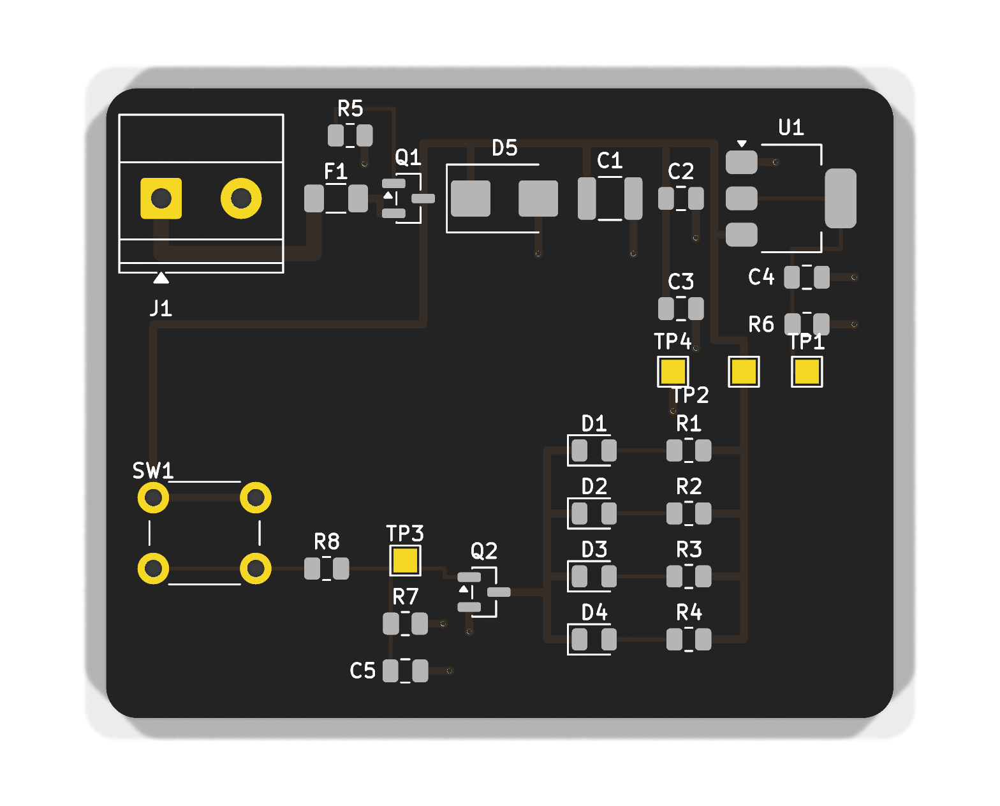
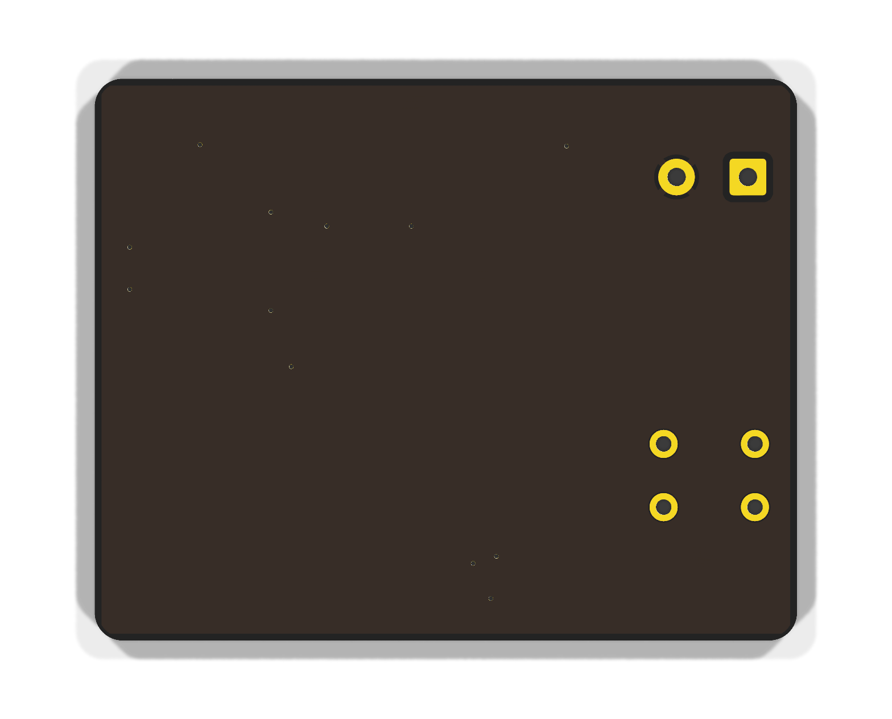

# led12 — 12 V LED board

A deliberately small board with no processor. Its job is to prove the design
pipeline end to end — declarative source, generated layout, rule checks,
simulation and CI gates — before any of it is trusted with the STM32H743
control board.

Press the button, four LEDs light. That is the whole function. Everything
interesting is in what had to be true for it to be correct.

| Top | Bottom |
|---|---|
|  |  |

50 × 40 mm, two layers, 28 parts, 63 track segments, 12 stitching vias, and a
ground pour on the back. **KiCad DRC reports nothing at any severity.**

## How it works

```
12V in ──[fuse 1A]──┬──[P-FET reverse polarity]──┬── 12V
                    │                            │
                   TVS                    47uF + 100nF
                                                 │
  button ──[10k]──┬── N-FET gate                 ├── 4 x (2k2 + LED)
                  │                              │       cathodes
             1uF ─┤ 100k                         └── LDO 3V3 ── 3k3 load
                  └── GND              N-FET drain sinks LED_RETURN
```

The input is fused, reverse-polarity protected by a P-FET whose gate sits at
ground, and clamped by a TVS. Pressing the button charges the gate of a
low-side N-FET through an RC network, which sinks the return of four LED
branches. A linear regulator provides a 3.3 V rail with a fixed load so it can
be measured. Four test pads expose 12 V, 3.3 V, ground and the gate.

## What is checked, and what that caught

Thirty-three checks, nine simulated measurements, and DRC against both the
PCBWay fab limits and the board's own design rules. Each gate has been made to
fail on purpose at least once — a gate that has never failed is not a gate.

Five real defects have been caught so far, each by a different tier:

| Found | By |
|---|---|
| Bulk capacitor was a **6.3 V part on a 12 V rail**, and 100 µF at 25 V does not exist in 1210 at all | Verifying every part against the distributor |
| Reverse-polarity FET rated **±8 V gate-source** in a circuit that puts 13.2 V across it in normal operation | The same |
| LED series resistors dissipating **104 % of their rating** at nominal, 137 % at the corner — 680 Ω is a 5 V habit on a 12 V rail | `checks/test_electrical.py` |
| Regulator rated **15 V against a TVS that clamps at 19.9 V** — the protection would have destroyed what it protects | `checks/test_electrical.py` |
| **TVS fitted backwards.** `out.hv ~> tvs ~> out.lv` reads perfectly and bridges anode-to-cathode, shorting the rail through a forward-biased diode | KiCad DRC, once the board was routed |

And two defects in the *pipeline itself*:

- The generated rules file lived in a directory the build deletes, so any DRC
  run outside `make drc` checked the board against **no custom rules** — and
  changed the copper, producing a different ground pour.
- The design source named `Device:Q_NMOS_GSD` and `Device:Q_PMOS_GSD`, which
  exist in no KiCad library. Nothing noticed for months.

## Bill of materials

Every part verified against LCSC — manufacturer, part number, supplier code,
stock and price — with a review note in `parts/<LIB>/<LIB>.md` recording the
datasheet it was read from and what a human confirmed.

| Ref | Value | Part | LCSC |
|---|---|---|---|
| C1 | 47 µF 25 V 1210 | Chinocera HGC1210R5476M250NSVK | C7432791 |
| C2 | 100 nF 50 V | YAGEO CC0805KRX7R9BB104 | C49678 |
| C3, C5 | 1 µF 50 V | Samsung CL21B105KBFNNNE | C28323 |
| C4 | 10 µF 25 V | Samsung CL21A106KAYNNNE | C15850 |
| D1–D4 | red LED, Vf 2.0–2.4 V | Everlight 17-21SURC/S530-A3/4T | C2943978 |
| D5 | TVS, 12 V standoff, 19.9 V clamp | Brightking SMBJ12A/TR13 | C111091 |
| F1 | 1 A slow-blow | Littelfuse 0468001.NRHF | C45157 |
| J1 | 2-pole 5.08 mm terminal | Ningbo Kangnex WJ500V-5.08-2P | C8465 |
| Q1 | P-FET, −30 V, ±20 V gate | Alpha & Omega AO3407A | C15155 |
| Q2 | N-FET, 60 V, logic level | onsemi 2N7002LT1G | C16338 |
| R1–R4 | 2.2 k 1 % | Yageo RC0805FR-072K2L | C114561 |
| R5, R7 | 100 k 1 % | Yageo RC0805FR-07100KL | C96346 |
| R6 | 3.3 k 1 % | Yageo RC0805FR-073K3L | C114531 |
| R8 | 10 k 1 % | Yageo RC0805FR-0710KL | C84376 |
| SW1 | 6 mm tactile | Korean Hroparts K2-1102DP-C4SW-04 | C110153 |
| U1 | 3.3 V LDO, 44 V max in | Gainsil GS2401C-33CTR3 | C6283798 |
| TP1–TP4 | test pads | bare copper, deliberately off the BOM | — |

## Where the port stands

The design source is being moved off **atopile**, whose authors have abandoned
the open-source project — zero commits since 2026-03-11, every service except
telemetry switched off, the successor a sign-in-only browser product. The
replacement is **SKiDL**: MIT, maintained since 2016, with no company behind it
and nothing to switch off.

Only the design source changes. The layout engine, the checks, the simulation
and CI all stay.

| | |
|---|---|
| **S0** Spike, and freeze the reference | **done** |
| **S1** Parts as Python data, symbol checks | **done** |
| S2 The board as `@SubCircuit` blocks | next |
| S3 The board writer, as text s-expressions | |
| S4 Re-point the checks and simulation | |
| S5 Remove atopile | |
| S6 The gates SKiDL makes possible | |

`reference/` holds the board as it is today, frozen while atopile still builds:
the fingerprint, the pad-level netlist, the BOM, the DRC report, the placement
file and the rendered simulation decks. The port is accepted when the
SKiDL-built board reproduces them.

## The files

| | |
|---|---|
| `parts.py` | every part as data — symbol, footprint, part number, datasheet figures |
| `src/led12.ato` | the board, in atopile's language (being replaced) |
| `layout.py` | placement, routing, vias and the ground pour |
| `rules.kicad_dru` | design intent: track widths, clearances |
| `sim/` | ngspice decks, device models and the bands each measurement must meet |
| `parts/<LIB>/` | footprint, and the review note recording what a human checked |
| `reference/` | the frozen golden set the port is measured against |

Everything else — how to build it, what each gate does, and what was learned
about the tools — is in [`../README.md`](../README.md).
