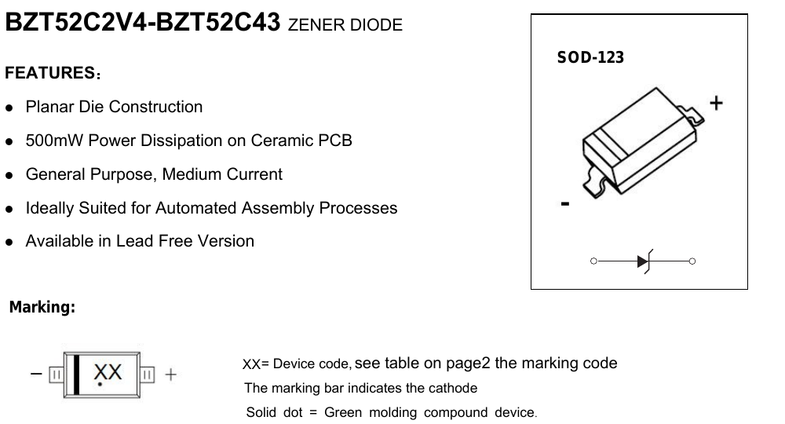

# SOD123 — gate-source Zener clamp

| | |
|---|---|
| Component | `ZENER_GATE_CLAMP` |
| Manufacturer | Jiangsu Changjing Electronics Technology |
| Part number | `BZT52C15` |
| LCSC | [C2104](https://www.lcsc.com/product-detail/C2104.html) |
| Footprint | `D_SOD-123` |

| | |
|---|---|
| Zener voltage | **13.8 to 15.6 V** at I_ZT |
| Power | 500 mW |
| Reverse leakage | 100 nA at 1 V |
| Operating temperature | −55 to +150 °C |
| Stock | 64,622 |
| $ @ 1–499 | 0.0205 |

Stock, price and the electrical figures were read from JLCPCB's component API
and cross-checked against LCSC's own product page for C2104, which states
`BZT52C15`, `SOD-123`, `13.8V~15.6V` and `500mW`. Two independent sources agree.

## Why this part exists

It clamps the reverse-polarity FET's gate-source voltage.

Q1's gate sits at ground through R5, so `V_GS = −V_rail`. In normal operation
that is −12 V nominal and −13.2 V at the top of the range, which the AO3407A's
±20 V gate rating covers comfortably. **During a surge it does not.** The input
TVS clamps the rail at up to 23.2 V, and the gate follows ground, so V_GS would
reach −23.2 V against a ±20 V absolute maximum — straight through it, on a part
whose failure mode is a punched-through gate oxide and a permanently shorted
pass element. Even against the SMBJ12A the board previously carried, whose
clamp was 19.9 V, the margin was 0.1 V.

**D7 is the same part on the other FET.** The low-side switch's gate hangs on a
10k/100k divider from the rail, so a 23.2 V clamp puts 21.1 V on a ±20 V gate
whenever the button happens to be held. Same part number, so no second line on
the bill of materials.

This is the same defect that got the Si2301 rejected — a gate rating exceeded by
the circuit's own normal behaviour — reappearing one layer down, under surge
rather than under DC. See `parts/SOT23/SOT23.md`.

## Why 15 V and not 12 V

The window is bounded at both ends, and it is narrow:

- **Above the rail.** The Zener must not conduct in normal operation, or it
  wastes current through R5 and pulls the gate up. The rail reaches 13.2 V, so
  V_Z(min) must exceed that. This part's minimum is **13.8 V** — 0.6 V of margin.
- **Below the FET's rating.** V_Z(max) plus nothing else must stay under the
  ±20 V both FETs share. This part's maximum is **15.6 V** — 4.4 V of margin.

A 12 V Zener fails the first test: its band straddles the nominal rail, so it
would sit on its knee continuously. An 18 V part would pass both but leaves only
2 V to the gate rating. 15 V is the middle of the only window that exists.

## Pin mapping

**Pad 1 = cathode** (the banded end), pad 2 = anode. This matches KiCad's
`Device:D_Zener`, whose pin 1 is named `K` and pin 2 `A`, and the stock
`Diode_SMD:D_SOD-123` footprint places pad 1 at the banded end of its
silkscreen.

On this board the **cathode goes to the source** (the protected 12 V rail) and
the **anode to the gate**, so the Zener is reverse-biased in normal operation
and breaks down only when the source rises more than V_Z above the gate.

**Confirmed against the manufacturer's own drawing.**

Jiangsu Changjing's Rev. 2.1: the package marked `+` at the banded end, the
diode symbol beneath it, and the marking note in words — *"The marking bar
indicates the cathode."* The board's silkscreen marks that end, and
`test_every_polarised_part_marks_its_cathode_on_the_silkscreen` keeps it
there.

**Footprint.** KiCad stock `Diode_SMD:D_SOD-123`, unmodified.
