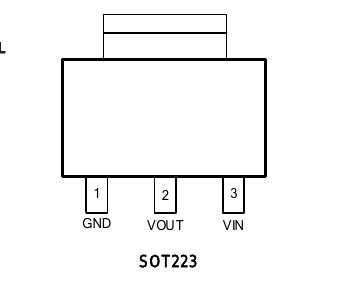
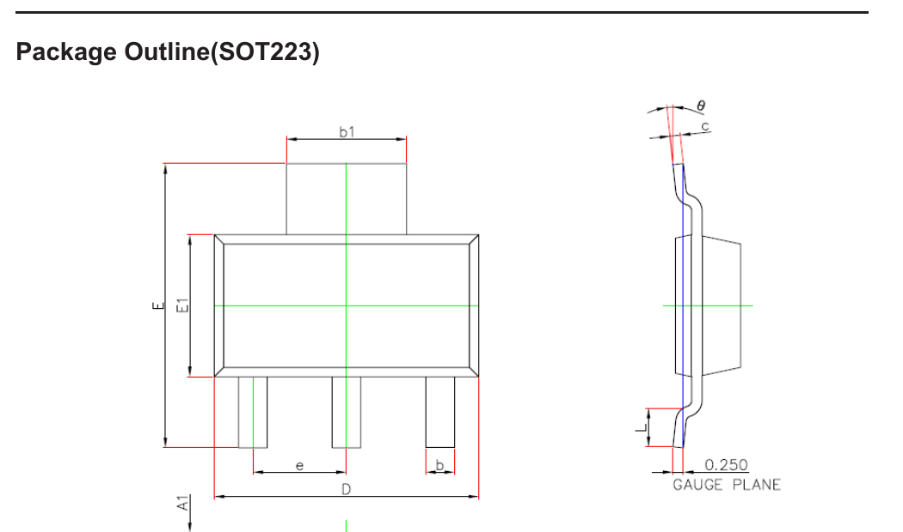

# SOT223 — SOT-223 linear regulator

| | |
|---|---|
| Component | `LDO_3V3` |
| Manufacturer | Gainsil |
| Part number | `GS2401C-33CTR3` |
| LCSC | [C6283798](https://www.lcsc.com/product-detail/C6283798.html) |
| Footprint | `SOT-223-3_TabPin2` |

Fixed 3.3 V CMOS LDO. Stock 585, $0.2097 at qty 5+. Extended.

| | |
|---|---|
| Input, absolute maximum | **44 V** (−0.3 to +44) |
| Input, operating | 2.5 to 40 V |
| Output accuracy | ±1 % |
| Quiescent current | 1.3 µA typical, 2 µA maximum |
| Dropout | 260 mV at 40 mA |
| Output current | 150 mA |

Datasheet: GS2401C family, rev V4 (November 2025). The PDF served for this
LCSC code has subset fonts with no `ToUnicode` map and no `cmap` table, so the
numbers above were read from the same family datasheet served for the sibling
code C52211850, which covers SOT223-3 explicitly.

## Why this part replaced the AMS1117

The AMS1117-3.3 is the obvious choice, is JLCPCB *Basic*, and was what the board
first used. Its absolute maximum input is **15 V**, and the input TVS clamps at
**23.2 V**. During a surge the regulator would have failed before the TVS did
anything useful — the protection would have been decorative.

That is not fixable at the TVS end. A device that must stand off 13.2 V without
conducting cannot clamp below about 20 V at rated surge current, so the regulator had
to move rather than the protection.

This part takes 44 V absolutely and **operates** to 40 V, so a clamp event
leaves it inside its normal operating range rather than merely alive. The
quiescent current is the unexpected bonus: 1.3 µA against roughly 5 mA, which on
a board whose entire 3.3 V load is 1 mA is most of the idle draw. It is also
slightly cheaper than a genuine AMS1117, and ±1 % rather than ±2 %.

`hw/checks/test_electrical.py::test_rail_parts_survive_the_tvs_clamp` is the
check that enforces this, comparing every part on the 12 V rail against the
TVS's declared clamping voltage. It failed on the AMS1117 and passes now.

## Pin mapping

Pin 1 = GND, pin 2 = VOUT, pin 3 = VIN, tab = VOUT. Reconstructed from the
datasheet's own pin table, whose first column covers SOT23-3 and SOT223-3
jointly, and matching the package graphic. Unchanged from the AMS1117, so the
footprint and the board's pad-to-net assignment did not move.

This pinout is rare in the package: of 76 SOT-223 3.3 V regulators rated 24 V or
better in the catalogue, only three use GND/VOUT/VIN. Everything else — LM2937,
TPS7B69xx, TLE427xx, BD433, SPX2920 and the rest — is the 78xx-style
VIN/GND(tab)/VOUT, which would need all three nets re-routed. **Do not
substitute by rating alone.**

**Confirmed from GAINSIL's own drawings.**

The *Pin Description* numbers the leads: **1 GND, 2 VOUT, 3 VIN**, with the tab
drawn above them and carrying no number of its own.

The *Package Outline (SOT223)* shows three leads and a tab, the tab (`b1`) and
the centre lead sharing one centre line and one piece of leadframe. The part is
offered as **SOT223-3**, three terminals — so the tab is not a fourth node, and
in a three-lead SOT-223 the tab is the centre lead widened.

That is the question this note was open on, and it closes the dangerous way
round: **GND is pin 1, an outer lead.** The tab therefore cannot be ground
without the package being a four-terminal SOT-223, which this is not. Tab =
pin 2 = VOUT, which is what `SOT-223-3_TabPin2` wires, and 3V3 cannot be
shorted to GND by it.

## Capacitors

The datasheet's application circuit is 1 µF in and 1 µF out, and the electrical
table is characterised at 1 µF load. It is a CMOS LDO with **no minimum-ESR
requirement**, so ceramics are fine and the LP2951-style stability window does
not apply.

The board's input capacitor was changed from 100 nF to 1 µF to match. The
output stays at 10 µF, above the characterised value with no stated maximum.

## Thermal

At 12 V in, 3.3 V out and 5 mA the regulator dissipates 43.5 mW. With
θJA = 65 °C/W that is a 2.8 °C junction rise, against a 0.3 W package limit. At
the board's real load of about 1 mA it is 8.7 mW. Thermally a non-event; no
copper pour needed.

## Fallback

**ASPL1117-3.3-DT-R**, LCSC C520553, $0.0788, stock 7,880. A 1117 clone, so
tab = VOUT is certain and the pinout is exact. Its absolute maximum input is
**24 V** — which now clears the SMBJ14A's 23.2 V clamp by only **0.8 V**, where
it used to have 4 V against the SMBJ12A. Its quiescent current is also 2 mA
typical. It is still the fallback if the Gainsil part's stock of 585 runs out or
the tab check above fails, but the margin is thin enough that the TVS should be
reconsidered at the same time.
