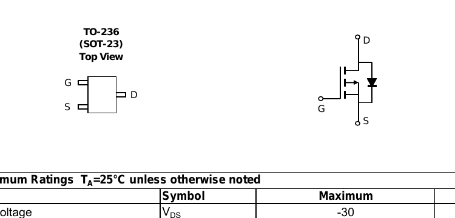

# SOT23 — SOT-23 MOSFETs

| | |
|---|---|
| Component | `NFET_SWITCH` `PFET_RPP` |
| Manufacturer | AOS / onsemi |
| Part number | `AO3407A, 2N7002LT1G` |
| LCSC | [C15155](https://www.lcsc.com/product-detail/C15155.html) |
| Footprint | `SOT-23` |

| Role | Manufacturer | Part number | LCSC | Stock | $ @ 100 |
|---|---|---|---|---|---|
| Reverse-polarity pass element | Alpha & Omega | AO3407A | C15155 | 137,790 | 0.0777 |
| Low-side LED switch | onsemi | 2N7002LT1G | C16338 | 268,300 | 0.0324 |

## AO3407A (P-channel)

V_DS −30 V, **V_GS ±20 V**, R_DS(on) < 48 mΩ at V_GS = −10 V, I_D −4.3 A.

**Corrected, and this one mattered.** The board first named a Vishay Si2301
(SI2301CDS-T1-GE3). In this circuit the gate is held at ground through 100 kΩ
while the source sits at the input, so V_GS is the whole rail: −12 V nominal,
−13.2 V at the top of the range. The Si2301 is rated **±8 V** gate to source, so
it would have been over-stressed *in normal operation*, not merely during a
transient. Its −20 V drain rating also sat below the TVS clamping voltage of
19.9 V, leaving no surge margin. The AO3407A clears both.

Watch the near-miss substitutes: AO3401A is JLCPCB *Basic* and looks like the
obvious cheap choice, but it is ±12 V on the gate — still exceeded at 13.2 V.
AO3415A is ±8 V. The AO3407A is the one that actually clears ±20 V.

## 2N7002LT1G (N-channel)

V_DSS 60 V, V_GS(th) 1.0–2.5 V, R_DS(on) 7.5 Ω at V_GS = 10 V, I_D 115 mA
continuous at 25 °C (75 mA at 100 °C, 800 mA pulsed), P_D 225 mW.

Carries all four LED branches, about 20 mA, so it runs at under a fifth of its
continuous rating and drops about 0.15 V. That drop is part of the LED current
calculation, is checked in `hw/checks/`, and is measured in
`sim/led_branch.cir.in`, which bands it at 0.10 to 0.25 V.

## Pin mapping

Both parts: **pin 1 = gate, pin 2 = source, pin 3 = drain**.

For the 2N7002 this is confirmed verbatim from the onsemi package drawing
("STYLE 21: PIN 1. GATE 2. SOURCE 3. DRAIN"). For the AO3407A it comes from the
LCSC/EasyEDA symbol, because the AOS datasheet's pin diagram is an image — its
*electrical* figures were read from the datasheet text. **Confirmed against Alpha & Omega's own drawing.**

The TO-236 (SOT-23) *Top View* puts **G upper-left, S lower-left and D on the
right**. It carries no pin numbers — but it does not need to, because KiCad's
`SOT-23` footprint is drawn in the same orientation: pad 1 at (-0.94, -0.95)
upper-left, pad 2 at (-0.94, +0.95) lower-left, pad 3 at (+0.94, 0) on the
right. Laying the two top views over each other gives **1 = G, 2 = S, 3 = D**
with no numbering convention appealed to, which is what
`Transistor_FET:Q_PMOS_GSD` says and what
`test_reverse_polarity_fets_face_the_supply` reads the drain off.

## Gate ratings

Both parts are **±20 V gate-source**, and both now have a 15 V Zener holding
them there during a surge: the TVS clamps at 23.2 V, which without D6 and D7
would put 23.2 V across Q1's gate and 21.1 V across Q2's. See
`parts/SOD123/SOD123.md`. `max_gate_source_voltage` is recorded in `parts.py`
so `test_fet_gates_survive_the_tvs_clamp` can read it; it was the rating that
rejected the Si2301 and it was not written down anywhere a check could reach.

## Orientation

**Q1's drain faces the supply.** A P-MOSFET's body diode has its anode on the
drain, so that is the orientation in which it blocks a reversed input. The board
was built the other way round - source to the supply, which is the high-side
load-switch drawing - and worked perfectly while being entirely unprotected.

**Footprint.** KiCad stock `Package_TO_SOT_SMD:SOT-23`, unmodified.
